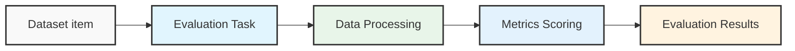

The Opik TypeScript SDK provides a powerful and easy-to-use interface for tracing, monitoring, and debugging your JavaScript and TypeScript applications. It offers comprehensive observability for LLM applications, agent workflows, and AI-powered systems.

## Integrations

Opik provides seamless integrations with popular JavaScript/TypeScript frameworks and libraries:

**Frameworks:**

- **[Agno](/integrations/agno)** - Trace and monitor your Agno AI agent applications
- **[BeeAI](/integrations/beeai)** - Trace and monitor your BeeAI agent applications
- **[LangChain](/integrations/langchainjs)** - Trace and monitor your LangChain applications, including chains, agents, tools, and retrievers
- **[Mastra](/integrations/mastra)** - Trace and monitor your Mastra AI applications
- **[Vercel AI SDK](/integrations/vercel-ai-sdk)** - Integrate Opik with Vercel AI SDK for monitoring AI-powered applications

**Model Providers:**

- **[Cloudflare Workers AI](/integrations/cloudflare-workers-ai)** - Trace and monitor your Cloudflare Workers AI applications
- **[Gemini](/integrations/gemini-typescript)** - Trace and monitor your applications using the Google Generative AI Node.js SDK
- **[OpenAI](/integrations/openai-typescript)** - Trace and monitor your applications using the official OpenAI Node.js SDK

For a complete list of TypeScript/JavaScript integrations and other language integrations, see the [Integrations Overview](/integrations/overview).

## Installation

### Option 1: Using the Opik TS (Recommended)

The fastest way to get started is using the [Opik TS](/reference/typescript-sdk/opik-ts), an interactive CLI tool that sets up Opik automatically in your project:

```bash
npx opik-ts configure
```

The CLI will:

- Detect your project setup
- Install Opik SDK and integration packages
- Configure environment variables
- Set up Opik client for your LLM integrations

### Option 2: Manual Installation

You can also install the `opik` package manually using your favorite package manager:

```bash
npm install opik
```

## Opik Configuration

You can configure the Opik client using environment variables.

```bash
export OPIK_API_KEY="your-api-key"

# If running on Opik Cloud
export OPIK_URL_OVERRIDE="https://www.comet.com/opik/api"

# If running locally
export OPIK_URL_OVERRIDE="http://localhost:5173/api"

export OPIK_PROJECT_NAME="your-project-name"
export OPIK_WORKSPACE_NAME="your-workspace-name"
```

Or you can pass the configuration to the Opik client constructor.

```typescript
import { Opik } from "opik";

const client = new Opik({
  apiKey: "<your-api-key>",
  apiUrl: "https://www.comet.com/opik/api",
  projectName: "<your-project-name>",
  workspaceName: "<your-workspace-name>",
});
```

## Usage

<Tip>
  You can find the full Typescript reference documentation
  [here](https://www.jsdocs.io/package/opik).
</Tip>

```typescript
import { Opik } from "opik";

// Create a new Opik client with your configuration
const client = new Opik();

// Log 10 traces
for (let i = 0; i < 10; i++) {
  const someTrace = client.trace({
    name: `Trace ${i}`,
    input: {
      prompt: `Hello, world! ${i}`,
    },
    output: {
      response: `Hello, world! ${i}`,
    },
  });

  // For each trace, log 10 spans
  for (let j = 0; j < 10; j++) {
    const someSpan = someTrace.span({
      name: `Span ${i}-${j}`,
      type: "llm",
      input: {
        prompt: `Hello, world! ${i}:${j}`,
      },
      output: {
        response: `Hello, world! ${i}:${j}`,
      },
    });

    // Some LLM work
    await new Promise((resolve) => setTimeout(resolve, 100));

    // Mark the span as ended
    someSpan.end();
  }

  // Mark the trace as ended
  someTrace.end();
}

// Flush the client to send all traces and spans
await client.flush();
```

---

description: >-
A guided CLI tool for quickly integrating Opik SDK into your
Node.js/TypeScript projects with automatic configuration and setup.
headline: Opik TS | Opik Documentation
'og:description': >-
Configure Opik observability in Node.js apps effortlessly. Detect setups,
manage packages, and enable tracing for LLM integrations.
'og:site_name': Opik Documentation
'og:title': Streamline Node.js with Opik TS SDK
title: Opik TS - Interactive Setup Tool

---

The Opik TS is an interactive command-line tool that streamlines the process of adding Opik observability to your Node.js and TypeScript applications. It automatically detects your project setup, installs dependencies, and configures tracing for your LLM integrations.

## Features

- **🔍 Smart Detection**: Automatically detects your project setup (package manager, TypeScript configuration, existing integrations)
- **📦 Package Management**: Supports npm, yarn, pnpm, and bun
- **⚙️ Environment Configuration**: Creates or updates `.env` files with proper Opik configuration

## Getting Started

### Basic Usage

Run the CLI in your project directory:

```bash
npx opik-ts configure
```

The CLI will guide you through:

1. **Project Detection**: Identifies your package manager and project structure
2. **Dependency Installation**: Installs Opik SDK and integration packages
3. **Environment Setup**: Configures API keys and environment variables
4. **Code Generation**: Sets up Opik client in your root project folder
5. **Formatting**: Optionally applies Prettier formatting

### Requirements

- **Node.js**: Version 18 or higher
- **Package Manager**: npm, yarn, pnpm, or bun
- **Supported Project Types**:
  - Node.js applications
  - TypeScript projects
  - Express/Fastify APIs

## CLI Options

The CLI supports several command-line options for customization:

| Option            | Type    | Default           | Description                                                    | Environment Variable    |
| ----------------- | ------- | ----------------- | -------------------------------------------------------------- | ----------------------- |
| `--help`          | boolean | -                 | Display help information                                       | -                       |
| `--version`       | boolean | -                 | Show version number                                            | -                       |
| `--debug`         | boolean | `false`           | Enable verbose logging for troubleshooting                     | `OPIK_TS_DEBUG`         |
| `--default`       | boolean | `true`            | Use default options for all prompts (non-interactive)          | `OPIK_TS_DEFAULT`       |
| `--force-install` | boolean | `false`           | Force package installation even if peer dependency checks fail | `OPIK_TS_FORCE_INSTALL` |
| `--install-dir`   | string  | current directory | Specify custom installation directory                          | `OPIK_TS_INSTALL_DIR`   |
| `--use-local`     | boolean | `false`           | Skip deployment selection and configure for local development  | `OPIK_TS_USE_LOCAL`     |

### Examples

**Verbose debugging mode:**

```bash
npx opik-ts configure --debug
```

**Non-interactive mode with defaults:**

```bash
npx opik-ts configure --default
```

**Install in a specific directory:**

```bash
npx opik-ts configure --install-dir=./my-app
```

**Force installation (skip peer dependency checks):**

```bash
npx opik-ts configure --force-install
```

**Local development setup:**

```bash
npx opik-ts configure --use-local
```

This will skip the deployment selection step and automatically configure your environment for local development (localhost:5173).

## Environment Configuration

The CLI automatically creates or updates your `.env` file with the necessary configuration:

```bash
# Opik Configuration
OPIK_API_KEY=your-api-key-here
OPIK_URL_OVERRIDE=https://www.comet.com/opik/api
OPIK_PROJECT_NAME=default
OPIK_WORKSPACE_NAME=default
```

<Tip>
  The CLI will prompt you to enter your API keys during setup. For Opik Cloud,
  you can get your API key from the [Opik
  dashboard](https://www.comet.com/opik). For self-hosted instances, set
  `OPIK_URL_OVERRIDE` to your server address.
</Tip>

## Troubleshooting

### Permission Errors

If you encounter permission errors during installation:

```bash
# Use --force-install to bypass peer dependency checks
npx opik-ts configure --force-install
```

### Package Manager Issues

If the CLI fails to detect your package manager:

1. Ensure you have a `package.json` in your project directory
2. Try running the CLI with debug mode: `npx opik-ts configure --debug`
3. Manually specify your package manager by selecting it from the prompts

### Environment Variable Setup

If environment variables aren't being set correctly:

1. Check that `.env` file was created in your project root
2. Ensure your application loads environment variables (e.g., using `dotenv`)
3. Restart your development server after running the CLI

### Integration Not Working

If traces aren't appearing in Opik:

1. Verify your `OPIK_API_KEY` is correct
2. Check that `OPIK_URL_OVERRIDE` points to the right endpoint
3. Ensure you're calling `flush()` before your application exits:
   ```typescript
   await trackedClient.flush();
   ```

### Debug Mode

Enable verbose logging to troubleshoot issues:

```bash
npx opik-ts configure --debug
```

This will show detailed information about:

- Project detection results
- Package installation steps
- File modifications
- Configuration changes

## CI/CD Integration

For automated deployments, use the non-interactive mode:

```bash
# In your CI/CD pipeline
npx opik-ts configure --default --force-install
```

Set environment variables beforehand:

```bash
export OPIK_API_KEY="your-api-key"
export OPENAI_API_KEY="your-openai-key"
npx opik-ts configure --default
```

## Next Steps

After running the CLI:

1. **Start Your Application**: Run your application and make LLM calls to see traces in Opik
2. **Explore Traces**: Visit the [Opik dashboard](https://www.comet.com/opik) to view your traces
3. **Add Custom Spans**: Learn about [manual tracing](/tracing/log_traces) for custom instrumentation
4. **Set Up Evaluation**: Configure [evaluation metrics](/evaluation/overview) for your LLM outputs
5. **Production Monitoring**: Set up [production monitoring](/production/production_monitoring) for your application

## Further Resources

- [TypeScript SDK Overview](/reference/typescript-sdk/overview)
- [OpenAI TypeScript Integration](/integrations/openai-typescript)
- [LangChain TypeScript Integration](/integrations/langchainjs)
- [Vercel AI SDK Integration](/integrations/vercel-ai-sdk)
- [GitHub Repository](https://github.com/comet-ml/opik)

---

headline: Prompts | Opik Documentation
'og:description': >-
Learn to version, store, and format LLM prompt templates using the Opik
TypeScript SDK for seamless integration with your codebase.
'og:site_name': Opik Documentation
'og:title': Manage Prompts Efficiently with Opik
title: Prompts

---

The Opik TypeScript SDK provides comprehensive prompt management functionality for versioning, storing, and formatting your LLM prompt templates. Prompts in Opik are versioned automatically, allowing you to track changes over time while seamlessly integrating with your codebase.

## Introduction

Opik supports two types of prompts:

- **Text Prompts**: Simple string templates for single-turn interactions
- **Chat Prompts**: Structured message-based templates for conversational AI with support for multimodal content (text, images, videos)

Each prompt:

- Has a unique name and auto-generated versions
- Supports Mustache or Jinja2 template syntax
- Tracks metadata, tags, and change descriptions
- Maintains complete version history
- Enables version comparison and rollback

## Getting Started

This section covers text prompts. For chat prompts with structured messages, see the [Chat Prompts](#chat-prompts) section.

### Creating Your First Prompt

Create a text prompt with the `createPrompt` method:

```typescript
import { Opik, PromptType } from "opik";

const client = new Opik();

const prompt = await client.createPrompt({
  name: "greeting-prompt",
  prompt: "Hello {{name}}, your score is {{score}}",
  type: PromptType.MUSTACHE,
  metadata: { version: "1.0" },
  tags: ["greetings"],
});

console.log(`Created prompt with commit: ${prompt.commit}`);
```

### Retrieving Prompts

Get prompts by name or specific version:

```typescript
// Get latest version
const prompt = await client.getPrompt({ name: "greeting-prompt" });

if (prompt) {
  console.log(`Template: ${prompt.prompt}`);
  console.log(`Commit: ${prompt.commit}`);
}

// Get specific version
const oldVersion = await client.getPrompt({
  name: "greeting-prompt",
  commit: "abc123de",
});
```

### Formatting Prompts

Opik supports two powerful template engines:

- **[Mustache](https://mustache.github.io/)** - Simple, logic-less templates with `{{variable}}` placeholders (default)
- **[Jinja2](https://jinja.palletsprojects.com/)** - Advanced templating with control flow using `` blocks and `{{ }}` variables

The `format()` method works on both `Prompt` and `PromptVersion` instances:

```typescript
const prompt = await client.getPrompt({ name: "greeting-prompt" });

// Format with variables
const text = prompt.format({ name: "Alice", score: 95 });
// Returns: "Hello Alice, your score is 95"

// Format also works on PromptVersion objects
const versions = await prompt.getVersions();
const previousVersion = versions[1];
const oldText = previousVersion.format({ name: "Alice", score: 95 });
```

**Template Syntax Examples:**

```typescript
// Mustache syntax (default)
await client.createPrompt({
  name: "mustache-prompt",
  prompt: "Hello {{name}}, your score is {{score}}",
  type: PromptType.MUSTACHE,
});

// Jinja2 syntax for advanced templating
await client.createPrompt({
  name: "jinja2-prompt",
  prompt: "Hello {{ name }}! Premium user",
  type: PromptType.JINJA2,
});
```

## Core Operations

### Creating and Updating

#### Understanding Version Creation

The `createPrompt` method intelligently handles versioning based on content changes:

**New version is created when:**

- Template content (`prompt`) changes
- Metadata changes (deep equality check)
- Template type (`type`) changes

**No new version (returns existing) when:**

- Template, metadata, and type are all identical
- Only `tags` or `description` differ

```typescript
// First call - creates new prompt with version 1
const prompt1 = await client.createPrompt({
  name: "greeting-prompt",
  prompt: "Hello {{name}}, your score is {{score}}",
  type: PromptType.MUSTACHE,
  metadata: { version: "1.0" },
  tags: ["greetings"],
});

// Same template, metadata, and type - returns existing version
const prompt2 = await client.createPrompt({
  name: "greeting-prompt",
  prompt: "Hello {{name}}, your score is {{score}}", // Same
  metadata: { version: "1.0" }, // Same
  type: PromptType.MUSTACHE, // Same
  tags: ["updated-tags"], // Different tags don't trigger new version
});
console.log(prompt2.commit === prompt1.commit); // true

// Changed template - creates new version 2
const prompt3 = await client.createPrompt({
  name: "greeting-prompt",
  prompt: "Hi {{name}}, score: {{score}}", // Different template
  changeDescription: "Simplified greeting message",
});

// Changed metadata - creates new version 3
const prompt4 = await client.createPrompt({
  name: "greeting-prompt",
  prompt: "Hi {{name}}, score: {{score}}", // Same as version 2
  metadata: { version: "2.0" }, // Different metadata triggers new version
  changeDescription: "Updated metadata",
});
```

<Note>
  Version creation is triggered by changes to **template content**,
  **metadata**, or **type**. Changes to `tags`, `name` or `description` alone do
  not create new versions - use `updateProperties()` for those.
</Note>

#### Updating Prompt Properties

Update prompt metadata without creating new versions:

```typescript
const prompt = await client.getPrompt({ name: "greeting-prompt" });

// Update name, description, or tags
await prompt.updateProperties({
  name: "welcome-prompt",
  description: "Updated greeting template",
  tags: ["welcome", "production", "v2"],
});

console.log(`Updated prompt name: ${prompt.name}`);
```

<Note>
  Updating properties (`name`, `description`, `tags`) does **not** create a new
  version. Only changes to the **template content**, **metadata**, or **type**
  trigger version creation.
</Note>

### Retrieving and Searching

#### Searching with Opik Query Language

Search and filter prompts using [Opik Query Language (OQL)](/docs/opik/reference/typescript-sdk/opik-query-language) - a powerful SQL-like syntax for finding exactly the prompts you need.

**Supported Fields:**

| Field                | Type     | Description                   | Example                                 |
| -------------------- | -------- | ----------------------------- | --------------------------------------- |
| `id`                 | String   | Unique prompt identifier      | `id = "prompt-123"`                     |
| `name`               | String   | Prompt name                   | `name contains "greeting"`              |
| `description`        | String   | Prompt description            | `description contains "template"`       |
| `tags`               | List     | Prompt tags                   | `tags contains "production"`            |
| `template_structure` | String   | Prompt type (text or chat)    | `template_structure = "chat"`           |
| `created_by`         | String   | Creator email/identifier      | `created_by = "user@example.com"`       |
| `created_at`         | DateTime | Creation timestamp            | `created_at > "2024-01-01"`             |
| `last_updated_by`    | String   | Last updater email/identifier | `last_updated_by = "admin@example.com"` |
| `last_updated_at`    | DateTime | Last update timestamp         | `last_updated_at > "2024-01-01"`        |

**Search Examples:**

```typescript
// Search all prompts (no filter)
const allPrompts = await client.searchPrompts();

// Search by exact name
const prompts = await client.searchPrompts('name = "greeting-prompt"');

// Search by name pattern
const chatPrompts = await client.searchPrompts('name contains "chat"');

// Search by tags
const prodPrompts = await client.searchPrompts('tags contains "production"');

// Search by creator
const myPrompts = await client.searchPrompts(
  'created_by = "alice@company.com"',
);

// Filter by prompt type
const chatPrompts = await client.searchPrompts('template_structure = "chat"');
const textPrompts = await client.searchPrompts('template_structure = "text"');

// Combine filters
const prodChatPrompts = await client.searchPrompts(
  'template_structure = "chat" AND tags contains "production"',
);
```

### Deleting Prompts

```typescript
const prompt = await client.getPrompt({ name: "greeting-prompt" });

// Delete prompt and all its versions
await prompt.delete();

// Or delete multiple prompts by ID
await client.deletePrompts([prompt.id, anotherPrompt.id]);
```

## Version Management

### Understanding Versions

#### Version Metadata and Properties

Access comprehensive version information:

```typescript
const prompt = await client.getPrompt({ name: "greeting-prompt" });
const versions = await prompt.getVersions();
const latest = versions[0];

// Version properties
console.log(`ID: ${latest.id}`);
console.log(`Commit: ${latest.commit}`);
console.log(`Template: ${latest.prompt}`);
console.log(`Created: ${latest.createdAt}`);
console.log(`Creator: ${latest.createdBy}`);
console.log(`Type: ${latest.type}`);
console.log(`Change: ${latest.changeDescription}`);

// Formatted version info
console.log(latest.getVersionInfo());
// Output: [abc123de] 2024-01-15 by user@example.com - Initial version

// Human-readable age
console.log(latest.getVersionAge());
// Output: "2 days ago"
```

#### Viewing Version History

```typescript
const prompt = await client.getPrompt({ name: "greeting-prompt" });

// Get all versions
const versions = await prompt.getVersions();

console.log(`Total versions: ${versions.length}`);

versions.forEach((version) => {
  console.log(version.getVersionInfo());
  // Output: [abc123de] 2024-01-15 by user@example.com - Initial version
});
```

### Working with Versions

#### Getting Specific Versions

```typescript
const prompt = await client.getPrompt({ name: "greeting-prompt" });

// Option 1: Get version as Prompt instance (recommended for formatting)
const oldVersion = await prompt.getVersion("abc123de");

if (oldVersion) {
  const text = oldVersion.format({ name: "Bob", score: 88 });
  console.log(`Old version output: ${text}`);
}

// Option 2: Use format directly on PromptVersion objects
const versions = await prompt.getVersions();
const secondVersion = versions[1];

// PromptVersion also has format() method
const formattedText = secondVersion.format({ name: "Charlie", score: 92 });
console.log(`Version ${secondVersion.commit}: ${formattedText}`);
```

#### Comparing Versions

```typescript
const versions = await prompt.getVersions();

if (versions.length >= 2) {
  const current = versions[0];
  const previous = versions[1];

  // Compare versions (logs diff and returns it)
  const diff = current.compareTo(previous);
  console.log(diff);
  /* Output:
   * - Current version [abc123de]
   * + Other version [def456gh]
   * @@ -1,2 +1,2 @@
   * - Hello {{name}}, welcome!
   * + Hello {{name}}, your score is {{score}}
   */
}
```

#### Restoring Previous Versions

```typescript
const prompt = await client.getPrompt({ name: "greeting-prompt" });
const versions = await prompt.getVersions();

// Find specific version to restore
const targetVersion = versions.find((v) => v.commit === "abc123de");

if (targetVersion) {
  // Restore creates a new version with the old content
  const restoredPrompt = await prompt.useVersion(targetVersion);

  console.log(`Restored to commit: ${restoredPrompt.commit}`);
  console.log(`Template: ${restoredPrompt.prompt}`);
}
```

## Advanced Usage

### Integration with Tracing

Prompts work seamlessly with Opik's tracing functionality:

```typescript
import { Opik, track } from "opik";

const client = new Opik();

@track
async function generateGreeting(userName: string, userScore: number) {
  // Get the prompt
  const prompt = await client.getPrompt({ name: "greeting-prompt" });

  // Format it
  const message = prompt.format({
    name: userName,
    score: userScore,
  });

  // Use with your LLM
  const response = await llmClient.complete(message);

  return response;
}
```

### Best Practices

#### Store Prompts in Code

Keep your prompts versioned alongside your code:

```typescript
// prompts/greeting.ts
export const GREETING_TEMPLATE = "Hello {{name}}, your score is {{score}}";

// In your application
import { GREETING_TEMPLATE } from "./prompts/greeting";

const prompt = await client.createPrompt({
  name: "greeting",
  prompt: GREETING_TEMPLATE,
  metadata: { version: "1.0" },
});
```

#### Use Meaningful Version Descriptions

```typescript
const prompt = await client.createPrompt({
  name: "summary-prompt",
  prompt: updatedTemplate,
  changeDescription: "Added support for multi-language summaries",
  metadata: { sprint: "Q1-2024" },
});
```

#### Tag Your Prompts

```typescript
const prompt = await client.createPrompt({
  name: "production-greeting",
  prompt: template,
  tags: ["production", "customer-facing", "v2"],
});

// Later, search by tags
const prodPrompts = await client.searchPrompts('tags contains "production"');
```

## Chat Prompts

Chat prompts are structured message-based templates designed for conversational AI applications. They support multiple message roles (system, user, assistant) and multimodal content including text, images, and videos.

### Key Features

- **Structured Messages**: Organize prompts as a list of messages with roles (system, user, assistant)
- **Multimodal Support**: Include images, videos, and text in the same prompt
- **Variable Substitution**: Use Mustache (`{{variable}}`) or Jinja2 syntax
- **Version Control**: Automatic versioning when messages change
- **Template Validation**: Optional validation of template placeholders

### Creating Chat Prompts

Create chat prompts using the `createChatPrompt` method:

```typescript
import { Opik, PromptType } from "opik";

const client = new Opik();

// Define chat messages with variables
const messages = [
  {
    role: "system",
    content: "You are a helpful assistant specializing in {{domain}}.",
  },
  {
    role: "user",
    content: "Explain {{topic}} in simple terms.",
  },
];

// Create a chat prompt
const chatPrompt = await client.createChatPrompt({
  name: "educational-assistant",
  messages: messages,
  type: PromptType.MUSTACHE,
  metadata: { category: "education" },
  tags: ["education", "assistant"],
});

console.log(`Created chat prompt with commit: ${chatPrompt.commit}`);
```

### Formatting Chat Prompts

Format chat prompts with variables to get ready-to-use message arrays:

```typescript
const chatPrompt = await client.getChatPrompt({
  name: "educational-assistant",
});

if (chatPrompt) {
  // Format the messages with variables
  const formattedMessages = chatPrompt.format({
    domain: "physics",
    topic: "quantum entanglement",
  });

  console.log(formattedMessages);
  // Output:
  // [
  //   { role: "system", content: "You are a helpful assistant specializing in physics." },
  //   { role: "user", content: "Explain quantum entanglement in simple terms." }
  // ]
}
```

### Multi-Turn Conversations

Create templates for multi-turn conversations:

```typescript
const messages = [
  {
    role: "system",
    content: "You are a customer support agent for {{company}}.",
  },
  {
    role: "user",
    content: "I have an issue with {{product}}.",
  },
  {
    role: "assistant",
    content:
      "I'd be happy to help with your {{product}}. Can you describe the issue?",
  },
  {
    role: "user",
    content: "{{issue_description}}",
  },
];

const chatPrompt = await client.createChatPrompt({
  name: "customer-support-flow",
  messages: messages,
});

// Format with specific values
const formatted = chatPrompt.format({
  company: "Acme Corp",
  product: "Widget Pro",
  issue_description: "It won't turn on",
});
```

### Multimodal Chat Prompts

Chat prompts support multimodal content for vision-enabled models:

#### Image Analysis

```typescript
// Chat prompt with image content
const messages = [
  {
    role: "system",
    content: "You analyze images and provide detailed descriptions.",
  },
  {
    role: "user",
    content: [
      { type: "text", text: "What's in this image of {{subject}}?" },
      {
        type: "image_url",
        image_url: {
          url: "{{image_url}}",
          detail: "high",
        },
      },
    ],
  },
];

const chatPrompt = await client.createChatPrompt({
  name: "image-analyzer",
  messages: messages,
});

// Format with variables
const formatted = chatPrompt.format(
  {
    subject: "a sunset",
    image_url: "https://example.com/sunset.jpg",
  },
  { vision: true }, // Supported modalities
);
```

#### Video Analysis

```typescript
// Chat prompt with video content
const messages = [
  {
    role: "system",
    content: "You analyze videos and provide insights.",
  },
  {
    role: "user",
    content: [
      { type: "text", text: "Analyze this video: {{description}}" },
      {
        type: "video_url",
        video_url: {
          url: "{{video_url}}",
          mime_type: "video/mp4",
        },
      },
    ],
  },
];

const chatPrompt = await client.createChatPrompt({
  name: "video-analyzer",
  messages: messages,
});

// Format with variables
const formatted = chatPrompt.format(
  {
    description: "traffic analysis",
    video_url: "https://example.com/traffic.mp4",
  },
  { vision: true, video: true },
);
```

#### Mixed Content

```typescript
// Chat prompt with multiple images and text
const messages = [
  {
    role: "user",
    content: [
      { type: "text", text: "Compare these two images:" },
      {
        type: "image_url",
        image_url: { url: "{{image1_url}}" },
      },
      { type: "text", text: "and" },
      {
        type: "image_url",
        image_url: { url: "{{image2_url}}" },
      },
      { type: "text", text: "What are the main differences?" },
    ],
  },
];

const chatPrompt = await client.createChatPrompt({
  name: "image-comparison",
  messages: messages,
});

const formatted = chatPrompt.format(
  {
    image1_url: "https://example.com/before.jpg",
    image2_url: "https://example.com/after.jpg",
  },
  { vision: true },
);
```

<Note>
  When formatting multimodal prompts, you can specify `supportedModalities` to
  control how content is rendered:

- If a modality is supported (e.g., `{ vision: true }`), the structured content is preserved
- If a modality is not supported, it's replaced with text placeholders (e.g., `<<<image>>><<</image>>>`)

This allows you to use the same prompt template with different models that may or may not support certain modalities.

</Note>

### Retrieving Chat Prompts

Get chat prompts by name or specific version:

```typescript
// Get latest version
const chatPrompt = await client.getChatPrompt({
  name: "educational-assistant",
});

if (chatPrompt) {
  console.log(`Messages: ${JSON.stringify(chatPrompt.messages)}`);
  console.log(`Commit: ${chatPrompt.commit}`);
}

// Get specific version
const oldVersion = await client.getChatPrompt({
  name: "educational-assistant",
  commit: "abc123de",
});
```

### Searching Chat Prompts

Search for chat prompts specifically using the `template_structure` filter:

```typescript
// Search for only chat prompts
const chatPrompts = await client.searchPrompts(
  'template_structure = "chat" AND name contains "assistant"',
);

for (const prompt of chatPrompts) {
  console.log(`Chat prompt: ${prompt.name}`);
}

// Search for text prompts only
const textPrompts = await client.searchPrompts('template_structure = "text"');
```

Without the `template_structure` filter, `searchPrompts` returns both text and chat prompts.

### Template Types for Chat Prompts

Chat prompts support two template types:

#### Mustache (Default)

```typescript
import { PromptType } from "opik";

const messages = [
  {
    role: "user",
    content: "Hello {{name}}, you live in {{city}}.",
  },
];

const chatPrompt = await client.createChatPrompt({
  name: "mustache-example",
  messages: messages,
  type: PromptType.MUSTACHE, // Default
});

const formatted = chatPrompt.format({
  name: "Alice",
  city: "Paris",
});
// Result: [{ role: "user", content: "Hello Alice, you live in Paris." }]
```

#### Jinja2

```typescript
import { PromptType } from "opik";

const messages = [
  {
    role: "user",
    content: `
      
      Hello {{ name }}, welcome to our premium service!
      
      Hello {{ name }}, welcome!
      
    `,
  },
];

const chatPrompt = await client.createChatPrompt({
  name: "jinja-example",
  messages: messages,
  type: PromptType.JINJA2,
});

// With premium user
const formatted1 = chatPrompt.format({
  name: "Alice",
  is_premium: true,
});
// Result includes: "Hello Alice, welcome to our premium service!"

// With regular user
const formatted2 = chatPrompt.format({
  name: "Bob",
  is_premium: false,
});
// Result includes: "Hello Bob, welcome!"
```

<Note>
  Jinja2 templates support advanced features like conditionals, loops, and
  filters, making them more powerful for complex prompt logic. However, Mustache
  templates are simpler and more portable.
</Note>

### Chat Prompt Versioning

Chat prompts are automatically versioned when the messages change:

```typescript
// Create initial version
const messagesV1 = [
  { role: "system", content: "You are helpful." },
  { role: "user", content: "Hi!" },
];

const chatPrompt = await client.createChatPrompt({
  name: "greeting-prompt",
  messages: messagesV1,
});

console.log(`Version 1 commit: ${chatPrompt.commit}`);

// Update with new messages - creates new version
const messagesV2 = [
  { role: "system", content: "You are a helpful assistant." },
  { role: "user", content: "Hello {{name}}!" },
];

const chatPromptV2 = await client.createChatPrompt({
  name: "greeting-prompt",
  messages: messagesV2,
  changeDescription: "Added personalization with name variable",
});

console.log(`Version 2 commit: ${chatPromptV2.commit}`);

// Get version history
const versions = await chatPrompt.getVersions();
console.log(`Total versions: ${versions.length}`);
```

### Version Management for Chat Prompts

Chat prompts support the same version management features as text prompts:

```typescript
const chatPrompt = await client.getChatPrompt({
  name: "greeting-prompt",
});

// Get all versions
const versions = await chatPrompt.getVersions();

// Get specific version
const oldVersion = await chatPrompt.getVersion("abc123de");

// Compare versions
if (versions.length >= 2) {
  const current = versions[0];
  const previous = versions[1];
  const diff = current.compareTo(previous);
  console.log(diff);
}

// Restore previous version
const targetVersion = versions.find((v) => v.commit === "abc123de");
if (targetVersion) {
  const restoredPrompt = await chatPrompt.useVersion(targetVersion);
  console.log(`Restored to commit: ${restoredPrompt.commit}`);
}
```

### Updating Chat Prompt Properties

Update chat prompt metadata without creating new versions:

```typescript
const chatPrompt = await client.getChatPrompt({
  name: "greeting-prompt",
});

// Update name, description, or tags
await chatPrompt.updateProperties({
  name: "welcome-prompt",
  description: "Updated greeting template",
  tags: ["welcome", "production", "v2"],
});

console.log(`Updated prompt name: ${chatPrompt.name}`);
```

<Note>
  Updating properties (`name`, `description`, `tags`) does **not** create a new
  version. Only changes to the **messages**, **metadata**, or **type** trigger
  version creation.
</Note>

## API Reference

### OpikClient Methods

#### `createPrompt(options)`

Creates a new prompt or returns existing version if content unchanged.

**Arguments:**

- `options.name: string` - Prompt name (required)
- `options.prompt: string` - Template content (required)
- `options.type?: PromptType` - Template engine (default: `MUSTACHE`)
- `options.promptId?: string` - Optional prompt ID
- `options.description?: string` - Optional description
- `options.metadata?: JsonNode` - Optional metadata
- `options.changeDescription?: string` - Version change description
- `options.tags?: string[]` - Optional tags

**Returns:** `Promise<Prompt>` - Created or existing prompt

#### `getPrompt(options)`

Retrieves a prompt by name and optional version.

**Arguments:**

- `options.name: string` - Prompt name (required)
- `options.commit?: string` - Optional commit hash for specific version

**Returns:** `Promise<Prompt | null>` - Prompt instance or null if not found

#### `searchPrompts(filterString?)`

Searches prompts with optional OQL filtering.

**Arguments:**

- `filterString?: string` - Optional OQL filter expression

**Returns:** `Promise<Prompt[]>` - Array of matching prompts

**Supported OQL fields:**

- `id`, `name`, `created_by`: String fields
- `tags`: List field (use "contains" operator)

**Operators:** `=`, `!=`, `contains`, `not_contains`, `starts_with`, `ends_with`, `>`, `<`

#### `deletePrompts(ids)`

Deletes multiple prompts and all their versions.

**Arguments:**

- `ids: string[]` - Array of prompt IDs to delete

**Returns:** `Promise<void>`

#### `createChatPrompt(options)`

Creates a new chat prompt or returns existing version if content unchanged.

**Arguments:**

- `options.name: string` - Chat prompt name (required)
- `options.messages: ChatMessage[]` - Array of chat messages with roles and content (required)
- `options.type?: PromptType` - Template engine (default: `MUSTACHE`)
- `options.promptId?: string` - Optional prompt ID
- `options.description?: string` - Optional description
- `options.metadata?: JsonNode` - Optional metadata
- `options.changeDescription?: string` - Version change description
- `options.tags?: string[]` - Optional tags

**Returns:** `Promise<ChatPrompt>` - Created or existing chat prompt

**ChatMessage Format:**

```typescript
interface ChatMessage {
  role: "system" | "user" | "assistant";
  content: string | ContentPart[];
}

interface ContentPart {
  type: "text" | "image_url" | "video_url";
  text?: string; // For text type
  image_url?: { url: string; detail?: string }; // For image_url type
  video_url?: { url: string; mime_type?: string }; // For video_url type
}
```

#### `getChatPrompt(options)`

Retrieves a chat prompt by name and optional version.

**Arguments:**

- `options.name: string` - Chat prompt name (required)
- `options.commit?: string` - Optional commit hash for specific version

**Returns:** `Promise<ChatPrompt | null>` - ChatPrompt instance or null if not found

### Prompt Class

#### Methods

##### `format(variables)`

Formats the prompt template with provided variables.

**Arguments:**

- `variables: Record<string, unknown>` - Variables to substitute

**Returns:** `string` - Formatted prompt text

**Throws:** `PromptValidationError` if required variables missing (Mustache only)

##### `getVersions()`

Retrieves all version history for this prompt.

**Returns:** `Promise<PromptVersion[]>` - Array of all versions (newest first)

##### `getVersion(commit)`

Gets a specific version as a Prompt instance.

**Arguments:**

- `commit: string` - Commit hash (8-char or full)

**Returns:** `Promise<Prompt | null>` - Prompt instance or null if not found

##### `useVersion(version)`

Restores a specific version by creating a new version with old content.

**Arguments:**

- `version: PromptVersion` - Version object to restore

**Returns:** `Promise<Prompt>` - New prompt instance with restored content

##### `updateProperties(updates)`

Updates prompt properties without creating new version.

**Arguments:**

- `updates.name?: string` - New prompt name
- `updates.description?: string` - New description
- `updates.tags?: string[]` - New tags array

**Returns:** `Promise<this>` - This prompt instance (for chaining)

##### `delete()`

Deletes this prompt and all its versions.

**Returns:** `Promise<void>`

#### Properties

- `id: string` - Unique prompt identifier
- `name: string` - Prompt name
- `prompt: string` - Current template content
- `commit?: string` - Current version commit hash
- `type: PromptType` - Template engine type
- `description?: string` - Prompt description
- `tags?: readonly string[]` - Prompt tags
- `metadata?: JsonNode` - Prompt metadata
- `changeDescription?: string` - Latest version change description

### PromptVersion Class

#### Methods

##### `format(variables)`

Formats this version's template with provided variables.

**Arguments:**

- `variables: Record<string, unknown>` - Variables to substitute

**Returns:** `string` - Formatted prompt text

##### `getVersionInfo()`

Gets formatted version information string.

**Returns:** `string` - Format: `[commit] YYYY-MM-DD by user@email.com - Change description`

##### `getVersionAge()`

Gets human-readable version age.

**Returns:** `string` - Format: "2 days ago", "Today", etc.

##### `compareTo(other)`

Compares this version's template with another version.

**Arguments:**

- `other: PromptVersion` - Version to compare against

**Returns:** `string` - Git-style unified diff showing changes

#### Properties

- `id: string` - Version unique identifier
- `name: string` - Associated prompt name
- `prompt: string` - Template content for this version
- `commit: string` - Version commit hash
- `type: PromptType` - Template engine type
- `metadata?: JsonNode` - Version metadata
- `changeDescription?: string` - Version change description
- `createdAt?: Date` - Creation timestamp
- `createdBy?: string` - Creator identifier

### ChatPrompt Class

The `ChatPrompt` class extends `BasePrompt` and provides chat-specific functionality for managing structured message-based prompts.

#### Methods

##### `format(variables, supportedModalities?)`

Formats the chat prompt messages with provided variables.

**Arguments:**

- `variables: Record<string, unknown>` - Variables to substitute in message content
- `supportedModalities?: SupportedModalities` - Optional modality support configuration

**SupportedModalities Format:**

```typescript
interface SupportedModalities {
  vision?: boolean; // Support for image content (default: true)
  video?: boolean; // Support for video content (default: true)
}
```

**Returns:** `ChatMessage[]` - Array of formatted chat messages

**Throws:** `PromptValidationError` if required variables missing (Mustache only)

**Example:**

```typescript
const formatted = chatPrompt.format(
  { name: "Alice", topic: "AI" },
  { vision: true, video: false },
);
```

##### `getVersions()`

Retrieves all version history for this chat prompt.

**Returns:** `Promise<PromptVersion[]>` - Array of all versions (newest first)

##### `getVersion(commit)`

Gets a specific version as a ChatPrompt instance.

**Arguments:**

- `commit: string` - Commit hash (8-char or full)

**Returns:** `Promise<ChatPrompt | null>` - ChatPrompt instance or null if not found

##### `useVersion(version)`

Restores a specific version by creating a new version with old content.

**Arguments:**

- `version: PromptVersion` - Version object to restore

**Returns:** `Promise<ChatPrompt>` - New chat prompt instance with restored content

##### `updateProperties(updates)`

Updates chat prompt properties without creating new version.

**Arguments:**

- `updates.name?: string` - New prompt name
- `updates.description?: string` - New description
- `updates.tags?: string[]` - New tags array

**Returns:** `Promise<this>` - This chat prompt instance (for chaining)

##### `delete()`

Deletes this chat prompt and all its versions.

**Returns:** `Promise<void>`

#### Properties

- `id: string` - Unique chat prompt identifier
- `name: string` - Chat prompt name
- `messages: ChatMessage[]` - Array of chat messages with roles and content
- `commit?: string` - Current version commit hash
- `type: PromptType` - Template engine type
- `description?: string` - Chat prompt description
- `tags?: readonly string[]` - Chat prompt tags
- `metadata?: JsonNode` - Chat prompt metadata
- `changeDescription?: string` - Latest version change description

---

headline: Opik Query Language (OQL) | Opik Documentation
'og:description': >-
Learn to use OQL for powerful data filtering in Opik with SQL-like syntax and
expressive conditions for precise data retrieval.
'og:site_name': Opik Documentation
'og:title': Opik Query Language (OQL) - Opik
title: Opik Query Language (OQL)

---

OQL provides a powerful, SQL-like syntax for filtering data in Opik. It's used with various SDK methods like `searchPrompts()` to find exactly the data you need using expressive filter conditions.

## Operators

### String Operators

```typescript
// Exact match
'name = "greeting-prompt"';

// Not equal
'name != "old-prompt"';

// Contains substring (case-insensitive)
'name contains "greeting"';

// Does not contain substring
'name not_contains "deprecated"';

// Starts with prefix
'name starts_with "prod-"';

// Ends with suffix
'name ends_with "-v2"';
```

### Comparison Operators

```typescript
// Greater than (alphabetical for strings)
'name > "m"'; // Names starting with n-z

// Less than (alphabetical for strings)
'name < "m"'; // Names starting with a-l
```

### List Operators

```typescript
// Check if list contains value
'tags contains "production"';

// Check if list does not contain value
'tags not_contains "experimental"';
```

## Combining Conditions

Use `AND` to combine multiple filter conditions. All conditions must be true for a result to match:

```typescript
// Multiple conditions with AND
'tags contains "production" AND name contains "greeting" AND created_by = "user@example.com"';

// Complex multi-field filtering
'name starts_with "prod-" AND tags contains "stable" AND name not_contains "deprecated"';
```

<Note>
  Currently, only `AND` logic is supported. `OR` logic is not available in OQL.
</Note>

## Examples

```typescript
import { Opik } from "opik";

const client = new Opik();

// Filter by single tag
const prod = await client.searchPrompts('tags contains "production"');

// Combine name pattern and tag
const approved = await client.searchPrompts(
  'name starts_with "prod-" AND tags contains "qa-approved"',
);

// Multiple conditions
const results = await client.searchPrompts(
  'created_by = "user@example.com" AND tags contains "production" AND name not_contains "deprecated"',
);
```

<Note>
  These examples use `searchPrompts()` but the same OQL syntax works with other
  search methods. Specific resource types may support additional fields - see
  their respective documentation.
</Note>

## Syntax Rules

### String Values

Always wrap string values in double quotes:

```typescript
// ✅ Correct - double quotes around values
await client.searchPrompts('name = "my-prompt"');
await client.searchPrompts('tags contains "production"');

// ❌ Incorrect - missing quotes
await client.searchPrompts("name = my-prompt"); // Will fail

// ❌ Incorrect - single quotes
await client.searchPrompts("name = 'my-prompt'"); // Will fail
```

### Error Handling

```typescript
try {
  const results = await client.searchPrompts("invalid syntax ===");
} catch (error) {
  console.error("Invalid OQL syntax:", error.message);
}
```

## Best Practices

1. **Use descriptive tag hierarchies** - Structure tags like `"production"`, `"staging"`, `"team-alpha"` for effective filtering
2. **Use naming conventions** - Implement consistent naming patterns (e.g., `"prod-"` prefix) to enable powerful filtering
3. **Handle errors** - Always wrap OQL queries in try-catch blocks to handle syntax errors gracefully

---

headline: Overview | Opik Documentation
'og:description': >-
Evaluate your LLM applications effectively using Opik's TypeScript SDK and the
powerful evaluate function for diverse evaluation scenarios.
'og:site_name': Opik Documentation
'og:title': Evaluate LLM Applications with Opik's TypeScript SDK
title: Evaluation

---

The TypeScript SDK provides a streamlined approach to evaluating your LLM applications with the `evaluate` function that handles various evaluation scenarios.



## Structure

The TypeScript SDK evaluation documentation covers:

- **[Quick Start](/reference/typescript-sdk/evaluation/quick-start)**: Get up and running with basic evaluations
- **[Datasets](/reference/typescript-sdk/evaluation/datasets)**: Working with evaluation datasets
- **[Evaluate Function](/reference/typescript-sdk/evaluation/evaluate)**: Using the evaluate function
- **[Evaluation Metrics](/reference/typescript-sdk/evaluation/metrics)**: Available metrics and creating custom metrics
- **[Experiments](/reference/typescript-sdk/evaluation/experiments)**: Creating and managing evaluation experiments

---

headline: Quick Start | Opik Documentation
'og:description': >-
Evaluate your AI models effectively. Learn to create datasets and analyze
results with Opik's TypeScript SDK in just 15 minutes.
'og:site_name': Opik Documentation
'og:title': Quick Start Guide for AI Evaluation - Opik
title: Quick Start

---

**In just 15 minutes**, learn how to evaluate your AI models with Opik's TypeScript SDK. This guide will walk you through creating a dataset, defining an evaluation task, and analyzing results with built-in metrics – everything you need to start making data-driven decisions about your AI systems.

## Complete Working Example

💡 **Copy, paste, and run** this complete example that:

1. Creates a structured dataset for AI evaluation
2. Defines an evaluation task using OpenAI's latest models
3. Runs an evaluation with built-in metrics and analyzes the results

```typescript
import { config } from "dotenv";
import { evaluate, EvaluationTask, Opik, ExactMatch } from "opik";
import OpenAI from "openai";

// Load environment variables from .env file
config();

// Initialize the OpenAI client
const client = new OpenAI();

// Create an Opik client
const opik = new Opik();

// define the type for DatasetItem
type DatasetItem = {
  input: string;
  expected_output: string;
  metadata: {
    category: string;
    difficulty: string;
    version: number;
  };
};

// Retrieve the existing dataset by name
const retrievedDataset = await opik.getOrCreateDataset<DatasetItem>(
  "testDataset",
);

// Add items to a dataset
const itemsToAdd = [
  {
    input: "What is machine learning?",
    expected_output:
      "Machine learning is a type of artificial intelligence that enables systems to learn and improve from experience without being explicitly programmed.",
    metadata: { category: "AI basics", difficulty: "beginner", version: 1 },
  },
];
await retrievedDataset.insert(itemsToAdd);

// Define a task that takes a dataset item and returns a result
const llmTask: EvaluationTask<DatasetItem> = async (datasetItem) => {
  const { input } = datasetItem;

  const response = await client.responses.create({
    model: "gpt-4o",
    instructions: "You are a coding assistant that talks like a pirate",
    input,
  });

  return { output: response.output_text };
};

// Run evaluation
const result = await evaluate({
  dataset: retrievedDataset,
  task: llmTask,
  scoringMetrics: [new ExactMatch()],
  experimentName: "My First Evaluation",

  // map the output of the task and dataset item data to the expected metric inputs
  scoringKeyMapping: {
    expected: "expected_output",
  },
});

console.log(`Experiment ID: ${result.experimentId}`);
console.log(`Experiment Name: ${result.experimentName}`);
console.log(`Total test cases: ${result.testResults.length}`);
```

## Step-by-Step Walkthrough

### 1. Setting up environment

```typescript
import { config } from "dotenv";
import { evaluate, EvaluationTask, Opik, ExactMatch } from "opik";
import OpenAI from "openai";

// Load environment variables from .env file
config();

// Initialize the OpenAI client
const client = new OpenAI();

// Create an Opik client
const opik = new Opik();
```

This section imports the necessary dependencies and configures your evaluation environment. The `dotenv` package securely loads your API keys from a `.env` file:

```
OPENAI_API_KEY=your_openai_api_key
OPIK_API_KEY=your_opik_api_key
OPIK_PROJECT_NAME=your_opik_project_name
OPIK_WORKSPACE=your_opik_workspace
```

### 2. Building a structured evaluation dataset

```typescript
// Create an Opik client
const opik = new Opik();

// define the type for DatasetItem
type DatasetItem = {
  input: string;
  expected_output: string;
  metadata: {
    category: string;
    difficulty: string;
    version: number;
  };
};

// Retrieve the existing dataset by name
const retrievedDataset = await opik.getOrCreateDataset<DatasetItem>(
  "testDataset",
);

// Add items to a dataset
const itemsToAdd = [
  {
    input: "What is machine learning?",
    expected_output:
      "Machine learning is a type of artificial intelligence that enables systems to learn and improve from experience without being explicitly programmed.",
    metadata: { category: "AI basics", difficulty: "beginner", version: 1 },
  },
];
await retrievedDataset.insert(itemsToAdd);
```

This section creates your evaluation dataset with full TypeScript support:

- **Initialize the client**: Connect to Opik's evaluation platform
- **Define your schema**: Use TypeScript types for dataset items with full IDE autocompletion
- **Retrieve or create**: Use `getOrCreateDataset` to seamlessly work with existing or new datasets
- **Add evaluation items**: Structure your test cases with inputs, expected outputs, and rich metadata for filtering and analysis

> 📌 **Best practice**: Add descriptive metadata to each item for powerful filtering and analysis in the Opik UI.

### 3. Defining your evaluation task

```typescript
// Define a task that takes a dataset item and returns a result
const llmTask: EvaluationTask<DatasetItem> = async (datasetItem) => {
  const { input } = datasetItem;

  const response = await client.responses.create({
    model: "gpt-4o", // Use any model you need to evaluate
    instructions: "You are a coding assistant that talks like a pirate",
    input,
  });

  return { output: response.output_text };
};
```

Your evaluation task:

- **Receives dataset items**: Automatically processes each item in your dataset
- **Integrates with any API**: Works with OpenAI, Anthropic, your own models, or any API
- **Returns structured output**: Package results in a format ready for evaluation

### 4. Running your evaluation

```typescript
// Run evaluation with a built-in ExactMatch metric
const result = await evaluate({
  dataset: retrievedDataset,
  task: llmTask,
  scoringMetrics: [new ExactMatch()], // Use multiple metrics for comprehensive evaluation
  experimentName: "My First Evaluation",

  // map the output of the task and dataset item data to the expected metric inputs
  scoringKeyMapping: {
    expected: "expected_output",
  },
});

console.log(`Experiment URL: ${result.resultUrl}`); // Direct link to view results
```

This single function call:

- The dataset we created
- Our defined LLM task
- The built-in `ExactMatch` metric that compares outputs exactly
- A name for the experiment
- Key mapping to connect dataset fields with metric inputs

## Expected Output

When you run this code, you'll receive an evaluation result object containing:

- `experimentId`: Unique identifier for your evaluation experiment
- `experimentName`: The name you provided
- `testResults`: Array of results for each dataset item
  - `testCase`: Contains the input data and outputs
  - `scoreResults`: Array of scores from each metric
- `resultUrl`: Link to view detailed results in the Opik platform

```typescript
{
  "experimentId": "01975908-818f-765a-abv6-08d179c15610",
  "experimentName": "My First Evaluation",
  "testResults": [
    {
      "testCase": {
        "traceId": "01975908-82dc-73fd-862d-dd51152ddse1",
        "datasetItemId": "01975908-810c-7663-b7a3-e3ae94484ca9",
        "scoringInputs": {
          "input": "What is machine learning?",
          "metadata": {
            "category": "AI basics",
            "difficulty": "beginner",
            "version": 1
          },
          "expected_output": "Machine learning is a type of artificial intelligence that enables systems to learn and improve from experience without being explicitly programmed.",
          "id": "01975908-810c-7663-b7a3-e3ae43884ca9",
          "output": "Arrr, machine learnin' be a way for computers to learn from data, akin to teachin' a parrot new tricks! Instead of givin' exact instructions, ye feed the machine lots o' examples, and it figures out how to make decisions on its own. It be useful for predictin' things, findin' patterns, and even speakin' like a fine pirate! 🏴‍☠️",
          "expected": "Machine learning is a type of artificial intelligence that enables systems to learn and improve from experience without being explicitly programmed."
        },
        "taskOutput": {
          "output": "Arrr, machine learnin' be a way for computers to learn from data, akin to teachin' a parrot new tricks! Instead of givin' exact instructions, ye feed the machine lots o' examples, and it figures out how to make decisions on its own. It be useful for predictin' things, findin' patterns, and even speakin' like a fine pirate! 🏴‍☠️"
        }
      },
      "scoreResults": [
        {
          "name": "exact_match",
          "value": 0,
          "reason": "Exact match: No match"
        }
      ]
    }
  ],
  "resultUrl": "https://comet.com/opik/api/v1/session/redirect/experiments/?experiment_id=01975908-818f-765a-abv6-08d179c15610&dataset_id=01975908-810c-7663-b7a3-e3ae94484ca9&path=aHR0cHM6Ly9kZXYuY29tZXQuY29tL29dfWsvYXBp"
}
```

## Troubleshooting & Best Practices

### API Key Issues

```
Error: Unauthorized: Invalid API key
```

- Make sure you've set up your `.env` file correctly
- Verify your API keys are valid and have the correct permissions

### Metric Input Mapping

```
Error: Metric 'ExactMatch' is skipped, missing required arguments: expected. Available arguments: output.
```

- Review your `scoringKeyMapping` to ensure it maps correctly to your dataset structure
- Check that all metric required inputs are provided either in task output or via mapping

---

headline: Datasets | Opik Documentation
'og:description': >-
Learn to create and manage datasets in Opik for effective evaluation,
leveraging TypeScript's type safety and deduplication features.
'og:site_name': Opik Documentation
'og:title': Manage Datasets with Opik TypeScript SDK
title: Datasets

---

The Opik TypeScript SDK provides robust functionality for creating and managing datasets. Datasets in Opik serve as collections of data items that can be used for various purposes, including evaluation.

## Dataset Fundamentals

A dataset in Opik is a named collection of data items. Each dataset:

- Has a unique identifier and name
- Contains items that share a common structure
- Supports powerful deduplication capabilities
- Using for evaluation

## TypeScript Type Safety

One of the key features of the Opik SDK is strong TypeScript typing support for datasets. You can define custom types for your dataset items to ensure type safety throughout your application:

```typescript
// Define a custom dataset item type
type QuestionAnswerItem = {
  question: string;
  answer: string;
  metadata: {
    category: string;
    difficulty: string;
  };
};

// Create a typed dataset
const dataset = await opik.createDataset<QuestionAnswerItem>(
  "qa-dataset", // Dataset name
  "Question-Answer pairs for evaluation", // Dataset description
);
```

## Working with Datasets

### Creating Datasets

```typescript
// Create a new dataset
await opik.createDataset<YourItemType>(
  "dataset-name",
  "Optional dataset description",
);

// Get an existing dataset or create it if it doesn't exist
const dataset = await opik.getOrCreateDataset<YourItemType>(
  "dataset-name",
  "Optional dataset description",
);
```

### Managing Dataset Items

```typescript
// Insert items
await dataset.insert([
  { id: "item1", question: "What is ML?", answer: "Machine learning is..." },
  {
    id: "item2",
    question: "What is AI?",
    answer: "Artificial intelligence is...",
  },
]);

// Update existing items
await dataset.update([
  {
    id: "item1",
    question: "What is Machine Learning?",
    answer: "Updated answer...",
  },
]);

// Delete specific items
await dataset.delete(["item1", "item2"]);

// Clear all items from the dataset
await dataset.clear();
```

<Tip>
  The Opik SDK automatically handles deduplication when inserting items into a
  dataset. This feature ensures that identical items are not added multiple
  times.
</Tip>

### Retrieving Dataset Items

```typescript
// Get a specific number of items
const items = await dataset.getItems(10);

// Get items with pagination
const firstBatch = await dataset.getItems(10);
const lastItemId = firstBatch[firstBatch.length - 1].id;
const nextBatch = await dataset.getItems(10, lastItemId);
```

### Working with JSON

```typescript
// Import items from a JSON string
const jsonData = JSON.stringify([
  {
    query: "What is the capital of France?",
    response: "Paris",
    tags: ["geography", "europe"],
  },
]);

// Map JSON keys to dataset item fields
const keysMapping = {
  query: "question", // 'query' in JSON becomes 'question' in dataset item
  response: "answer", // 'response' in JSON becomes 'answer' in dataset item
  tags: "metadata.tags", // 'tags' in JSON becomes 'metadata.tags' in dataset item
};

// Specify keys to ignore
const ignoreKeys = ["irrelevant_field"];

// Insert from JSON with mapping
await dataset.insertFromJson(jsonData, keysMapping, ignoreKeys);

// Export dataset to JSON with custom key mapping
const exportMapping = { question: "prompt", answer: "completion" };
const exportedJson = await dataset.toJson(exportMapping);
```

## API Reference

<Info>
  The generic type parameter `T` represents the DatasetItem type that defines
  the structure of items stored in this dataset.
</Info>
### OpikClient Dataset Methods

#### `createDataset<T>`

Creates a new dataset.

**Arguments:**

- `name: string` - The name of the dataset
- `description?: string` - Optional description of the dataset

**Returns:** `Promise<Dataset<T>>` - A promise that resolves to the created Dataset object

#### `getDataset<T>`

Retrieves an existing dataset by name.

**Arguments:**

- `name: string` - The name of the dataset to retrieve

**Returns:** `Promise<Dataset<T>>` - A promise that resolves to the Dataset object

#### `getOrCreateDataset<T>`

Retrieves an existing dataset by name or creates it if it doesn't exist.

**Arguments:**

- `name: string` - The name of the dataset
- `description?: string` - Optional description (used only if creating a new dataset)

**Returns:** `Promise<Dataset<T>>` - A promise that resolves to the existing or newly created Dataset object

#### `getDatasets<T>`

Retrieves a list of datasets.

**Arguments:**

- `maxResults?: number` - Optional maximum number of datasets to retrieve (default: 100)

**Returns:** `Promise<Dataset<T>[]>` - A promise that resolves to an array of Dataset objects

#### `deleteDataset`

Deletes a dataset by name.

**Arguments:**

- `name: string` - The name of the dataset to delete

**Returns:** `Promise<void>`

### Dataset Class Methods

#### `insert`

Inserts new items into the dataset with automatic deduplication.

**Arguments:**

- `items: T[]` - List of objects to add to the dataset

**Returns:** `Promise<void>`

#### `update`

Updates existing items in the dataset.

**Arguments:**

- `items: T[]` - List of objects to update in the dataset (must include IDs)

**Returns:** `Promise<void>`

#### `delete`

Deletes items from the dataset.

**Arguments:**

- `itemIds: string[]` - List of item IDs to delete

**Returns:** `Promise<void>`

#### `clear`

Deletes all items from the dataset.

**Returns:** `Promise<void>`

#### `getItems`

Retrieves items from the dataset.

**Arguments:**

- `nbSamples?: number` - Optional number of items to retrieve (if not set, all items are returned)
- `lastRetrievedId?: string` - Optional ID of the last retrieved item for pagination

**Returns:** `Promise<T[]>` - A promise that resolves to an array of dataset items

#### `insertFromJson`

Inserts items from a JSON string into the dataset.

**Arguments:**

- `jsonArray: string` - JSON string in array format
- `keysMapping?: Record<string, string>` - Optional dictionary that maps JSON keys to dataset item field names
- `ignoreKeys?: string[]` - Optional array of keys to ignore when constructing dataset items

**Returns:** `Promise<void>`

#### `toJson`

Exports the dataset to a JSON string.

**Arguments:**

- `keysMapping?: Record<string, string>` - Optional dictionary that maps dataset item field names to output JSON keys

**Returns:** `Promise<string>` - A JSON string representation of all items in the dataset

---

headline: Evaluate Function | Opik Documentation
'og:description': >-
Evaluate LLM tasks against datasets using customizable metrics with the
evaluate function in Opik for precise assessments.
'og:site_name': Opik Documentation
'og:title': Evaluate Function - Opik
title: Evaluate Function

---

The `evaluate` function allows you to run comprehensive evaluations of LLM tasks against datasets using customizable metrics.

```typescript
async function evaluate(options: EvaluateOptions): Promise<EvaluationResult>;
```

## Parameters

The function accepts a single `options` parameter of type `EvaluateOptions`, which contains the following properties:

| Parameter           | Type                      | Required | Description                                                                                |
| ------------------- | ------------------------- | -------- | ------------------------------------------------------------------------------------------ |
| `dataset`           | `Dataset`                 | Yes      | The dataset to evaluate against, containing inputs and expected outputs                    |
| `task`              | `EvaluationTask`          | Yes      | The specific LLM task to perform                                                           |
| `scoringMetrics`    | `BaseMetric[]`            | No       | Optional array of metrics to evaluate model performance (e.g., accuracy, F1 score)         |
| `experimentName`    | `string`                  | No       | Optional name for this evaluation experiment for tracking and reporting                    |
| `projectName`       | `string`                  | No       | Optional project identifier to associate this experiment with                              |
| `experimentConfig`  | `Record<string, unknown>` | No       | Optional configuration settings for the experiment as key-value pairs                      |
| `nbSamples`         | `number`                  | No       | Optional number of samples to evaluate from the dataset (defaults to all if not specified) |
| `client`            | `OpikClient`              | No       | Optional Opik client instance to use for tracking                                          |
| `scoringKeyMapping` | `ScoringKeyMappingType`   | No       | Optional mapping between dataset keys and scoring metric inputs                            |

## Returns

The function returns a Promise that resolves to an `EvaluationResult` object containing:

- Aggregated scores across all evaluated samples
- Individual sample results
- Execution metadata

## Example Usage

```typescript
import {
  evaluate,
  EvaluationTask,
  Opik,
  BaseMetric,
  EvaluationScoreResult,
  ExactMatch,
} from "opik";
import OpenAI from "openai";

// Initialize clients
const openai = new OpenAI();
const opik = new Opik();

// Define dataset item type
type DatasetItem = {
  input: string;
  expected_output: string;
  metadata: {
    category: string;
    difficulty: string;
    version: number;
  };
};

// Define LLM task
const llmTask: EvaluationTask<DatasetItem> = async (datasetItem) => {
  const { input } = datasetItem;

  const response = await openai.responses.create({
    model: "gpt-4o",
    instructions: "You are a coding assistant",
    input,
  });

  return { output: response.output_text };
};

async function runEvaluation() {
  // Get or create dataset
  const dataset = await opik.getOrCreateDataset<DatasetItem>("example-dataset");

  // Run evaluation
  const result = await evaluate({
    dataset,
    task: llmTask,
    scoringMetrics: [new ExactMatch()],
    experimentName: "Example Evaluation",

    // Map the output of the task and dataset item data to the expected metric inputs
    scoringKeyMapping: {
      expected: "expected_output",
    },
  });
}
```

## Notes

- The function automatically creates an experiment in Opik for tracking and analysis
- If no `client` is provided, it uses the global Opik client instance
- You can provide type parameters to properly type your dataset and task inputs/outputs
- Errors during evaluation will be properly logged and re-thrown

---

headline: Evaluate Prompt Function | Opik Documentation
'og:description': >-
Evaluate prompt templates against datasets effortlessly with Opik. Streamline
formatting, generate responses, and assess results using key metrics.
'og:site_name': Opik Documentation
'og:title': Evaluate Prompt Function - Opik
title: evaluatePrompt Function

---

The `evaluatePrompt` function provides a streamlined way to evaluate prompt templates against a dataset. It automatically formats message templates with dataset variables, generates LLM responses, and evaluates the results using specified metrics.

## Overview

`evaluatePrompt` is a convenience wrapper around the [`evaluate`](/reference/typescript-sdk/evaluation/evaluate) function that handles:

- **Template formatting**: Automatically formats message templates with dataset item variables
- **Model invocation**: Generates LLM responses using your specified model
- **Experiment tracking**: Creates experiments linked to specific prompt versions
- **Metric evaluation**: Scores outputs using the specified metrics

This is particularly useful for prompt engineering workflows where you want to quickly test different prompt templates against a dataset.

## Function Signature

```typescript
function evaluatePrompt(
  options: EvaluatePromptOptions,
): Promise<EvaluationResult>;
```

### EvaluatePromptOptions

```typescript
interface EvaluatePromptOptions extends Omit<EvaluateOptions, "task"> {
  // Required parameters
  dataset: Dataset;
  messages: OpikMessage[];

  // Optional parameters
  model?: SupportedModelId | LanguageModel | OpikBaseModel;
  templateType?: "mustache" | "jinja2";
  scoringMetrics?: BaseMetric[];
  experimentName?: string;
  experimentConfig?: Record<string, unknown>;
  prompts?: Prompt[];
  projectName?: string;
  nbSamples?: number;
  scoringKeyMapping?: Record<string, string>;
}
```

## Parameters

### Required Parameters

#### dataset

- **Type**: `Dataset`
- **Description**: The dataset to evaluate prompts against. Each dataset item will be used to format the message templates and generate responses.

```typescript
const dataset = await client.getOrCreateDataset({
  name: "my-dataset",
});
```

#### messages

- **Type**: `OpikMessage[]`
- **Description**: Array of message templates with `{{placeholders}}` that will be formatted with dataset variables.

```typescript
messages: [
  { role: "system", content: "You are a helpful assistant" },
  { role: "user", content: "Translate to {{language}}: {{text}}" },
];
```

### Optional Parameters

#### model

- **Type**: `SupportedModelId | LanguageModel | OpikBaseModel`
- **Default**: `"gpt-4o"`
- **Description**: The language model to use for generation. Can be:
  - Model ID string (e.g., `"gpt-4o"`, `"claude-3-5-sonnet-latest"`, `"gemini-2.0-flash"`)
  - Pre-configured `LanguageModel` instance from Vercel AI SDK
  - Custom `OpikBaseModel` implementation

```typescript
// Using model ID string
model: "gpt-4o";

// Using LanguageModel instance
import { openai } from "@ai-sdk/openai";
const customModel = openai("gpt-4o");
model: customModel;
```

#### templateType

- **Type**: `"mustache" | "jinja2"`
- **Default**: `"mustache"`
- **Description**: Template engine to use for variable substitution in message content.

```typescript
// Mustache syntax (default)
templateType: "mustache";
messages: [{ role: "user", content: "Hello {{name}}" }];

// Jinja2 syntax
templateType: "jinja2";
messages: [{ role: "user", content: "Hello {{ name }}" }];
```

#### scoringMetrics

- **Type**: `BaseMetric[]`
- **Description**: Array of metrics to evaluate the generated outputs. Can include both heuristic and LLM Judge metrics.

```typescript
import { ExactMatch, Hallucination } from "opik";

scoringMetrics: [new ExactMatch(), new Hallucination()];
```

#### experimentName

- **Type**: `string`
- **Description**: Name for the experiment. If not provided, a name will be auto-generated.

```typescript
experimentName: "Prompt Evaluation - Translation Task";
```

#### experimentConfig

- **Type**: `Record<string, unknown>`
- **Description**: Additional metadata to store with the experiment. The function automatically adds `prompt_template` and `model` to this configuration.

```typescript
experimentConfig: {
  temperature: 0.7,
  max_tokens: 1000,
  version: "v2",
};
```

#### prompts

- **Type**: `Prompt[]`
- **Description**: Array of Opik Prompt objects to link to this experiment. Useful for tracking which prompt versions were used.

```typescript
const prompt = await client.createPrompt({
  name: "translation-prompt",
  prompt: "Translate to {{language}}: {{text}}",
});

prompts: [prompt];
```

#### projectName

- **Type**: `string`
- **Description**: Name of the Opik project to log traces to.

```typescript
projectName: "prompt-engineering";
```

#### nbSamples

- **Type**: `number`
- **Description**: Maximum number of dataset items to evaluate. Useful for quick testing.

```typescript
nbSamples: 10; // Only evaluate first 10 items
```

#### scoringKeyMapping

- **Type**: `Record<string, string>`
- **Description**: Maps metric parameter names to dataset/output field names when they don't match.

```typescript
scoringKeyMapping: {
  input: "question", // Map 'input' param to 'question' field
  expected: "reference_answer", // Map 'expected' param to 'reference_answer' field
};
```

## Return Value

Returns a `Promise<EvaluationResult>` containing:

```typescript
interface EvaluationResult {
  experimentId: string; // ID of created experiment
  experimentName: string; // Name of experiment
  testResults: TestResult[]; // Results for each dataset item
}
```

## Examples

### Basic Usage

Simple prompt evaluation with default settings:

```typescript
import { Opik, evaluatePrompt } from "opik";

const client = new Opik();
const dataset = await client.getOrCreateDataset({ name: "qa-dataset" });

await dataset.insert([
  {
    question: "What is the capital of France?",
    expected_answer: "Paris",
  },
  {
    question: "How do you calculate the area of a circle?",
    expected_answer: "π × radius²",
  },
]);

const result = await evaluatePrompt({
  dataset,
  messages: [
    {
      role: "system",
      content:
        "You are a helpful assistant. Answer questions accurately and concisely.",
    },
    { role: "user", content: "{{question}}" },
  ],
  model: "gpt-4o",
});

console.log(`Experiment ID: ${result.experimentId}`);
console.log(`Evaluated ${result.testResults.length} items`);
```

### With Scoring Metrics

Evaluate prompts with automatic scoring:

```typescript
import { evaluatePrompt } from "opik";
import { Hallucination, ExactMatch } from "opik";

// Create dataset with expected answers
const dataset = await client.getOrCreateDataset({ name: "geography-qa" });
await dataset.insert([
  {
    country: "France",
    expected_answer: "Paris",
  },
  {
    country: "Japan",
    expected_answer: "Tokyo",
  },
]);

await evaluatePrompt({
  dataset,
  messages: [
    {
      role: "user",
      content: "What is the capital of {{country}}?",
    },
  ],
  model: "gpt-4o",
  scoringMetrics: [
    new ExactMatch(), // Check exact match with expected output
    new Hallucination(), // Check for hallucinations
  ],
  experimentName: "Geography Quiz Evaluation",
});
```

### Using LanguageModel Instances

Use LanguageModel instances for provider-specific features:

```typescript
import { openai } from "@ai-sdk/openai";
import { evaluatePrompt } from "opik";

// Create model instance
const customModel = openai("gpt-4o");

await evaluatePrompt({
  dataset,
  messages: [{ role: "user", content: "Summarize: {{text}}" }],
  model: customModel,
  experimentConfig: {
    model_provider: "openai",
    model_name: "gpt-4o",
  },
});
```

### Multi-Provider Model Support

The function supports models from multiple providers:

```typescript
// OpenAI
model: "gpt-4o";

// Anthropic
model: "claude-3-5-sonnet-latest";

// Google Gemini
model: "gemini-2.0-flash";

// Or use provider-specific LanguageModel instances
import { anthropic } from "@ai-sdk/anthropic";
const claude = anthropic("claude-3-5-sonnet-latest");
model: claude;
```

### Linking to Prompt Versions

Track which prompt versions are used in evaluations:

```typescript
import { Opik, evaluatePrompt } from "opik";

const client = new Opik();

// Create or get a prompt
const prompt = await client.createPrompt({
  name: "customer-support-prompt",
  prompt: "{{system_message}}\n\nUser: {{user_query}}",
});

// Link the prompt to the evaluation
await evaluatePrompt({
  dataset,
  messages: [
    { role: "system", content: "{{system_message}}" },
    { role: "user", content: "{{user_query}}" },
  ],
  model: "gpt-4o",
  prompts: [prompt], // Link to prompt
  experimentName: "Customer Support - v2.1",
});
```

### Template Types

#### Mustache Templates (Default)

```typescript
await evaluatePrompt({
  dataset,
  messages: [
    {
      role: "user",
      content: "Hello {{name}}, your order #{{order_id}} is ready.",
    },
  ],
  templateType: "mustache", // This is the default
});
```

#### Jinja2 Templates

```typescript
await evaluatePrompt({
  dataset,
  messages: [
    {
      role: "user",
      content: "Hello {{ name }}, your order #{{ order_id }} is ready.",
    },
  ],
  templateType: "jinja2",
});
```

### Scoring Key Mapping

Map dataset fields to metric parameter names:

```typescript
// Dataset has: { question: "...", reference_answer: "..." }
// Metric expects: { input: "...", expected: "..." }

await evaluatePrompt({
  dataset,
  messages: [{ role: "user", content: "{{question}}" }],
  scoringMetrics: [new ExactMatch()],
  scoringKeyMapping: {
    input: "question",
    expected: "reference_answer",
  },
});
```

### Subset Evaluation

Evaluate only a subset of the dataset for quick iteration:

```typescript
await evaluatePrompt({
  dataset,
  messages: [{ role: "user", content: "{{prompt}}" }],
  nbSamples: 5, // Only evaluate first 5 items
  experimentName: "Quick Test",
});
```

## How It Works

When you call `evaluatePrompt`, the following happens:

1. **Template Formatting**: For each dataset item, message templates are formatted with item variables
2. **Model Invocation**: The formatted messages are sent to the specified model to generate a response
3. **Experiment Creation**: An experiment is created (or updated) with metadata
4. **Metric Scoring**: If metrics are provided, each output is scored
5. **Result Aggregation**: Results are collected and returned

## Experiment Configuration

The function automatically enriches experiment configuration with:

- `prompt_template`: The message templates used
- `model`: The model identifier (name or type)

You can add additional metadata via `experimentConfig`:

```typescript
experimentConfig: {
  // Auto-added by evaluatePrompt:
  // prompt_template: [{ role: 'user', content: '...' }]
  // model: 'gpt-4o'

  // Your custom metadata:
  temperature: 0.7,
  version: "v2.0",
  author: "team-ai",
  description: "Testing improved prompt structure",
};
```

## Best Practices

### 1. Start Simple, Then Add Metrics

Begin with basic prompt evaluation, then add metrics as needed:

```typescript
// Step 1: Basic evaluation to see outputs
await evaluatePrompt({
  dataset,
  messages: [{ role: "user", content: "{{input}}" }],
});

// Step 2: Add metrics after reviewing outputs
await evaluatePrompt({
  dataset,
  messages: [{ role: "user", content: "{{input}}" }],
  scoringMetrics: [new Hallucination()],
});
```

### 2. Use Descriptive Experiment Names

Make it easy to find and compare experiments:

```typescript
experimentName: "Translation - GPT-4o - v2.3 - 2025-01-15";
```

### 3. Version Your Prompts

Link evaluations to prompt versions for better tracking:

```typescript
const prompt = await client.createPrompt({
  name: "qa-prompt",
  prompt: "Answer: {{question}}",
  version: "v2.3",
});

await evaluatePrompt({
  dataset,
  messages: [{ role: "user", content: "Answer: {{question}}" }],
  prompts: [prompt],
});
```

### 4. Start with Small Samples

Use `nbSamples` for quick iteration before full evaluation:

```typescript
// Quick test with 10 samples
await evaluatePrompt({
  dataset,
  messages: [{ role: "user", content: "{{input}}" }],
  nbSamples: 10,
});

// Full evaluation once satisfied
await evaluatePrompt({
  dataset,
  messages: [{ role: "user", content: "{{input}}" }],
  // Evaluate entire dataset
});
```

### 5. Include Context in System Messages

Structure your prompts with clear system messages:

```typescript
messages: [
  {
    role: "system",
    content:
      "You are an expert {{domain}} assistant. Provide accurate, concise answers.",
  },
  {
    role: "user",
    content: "{{question}}",
  },
];
```

## Error Handling

The function validates inputs and throws errors for common issues:

```typescript
try {
  await evaluatePrompt({
    dataset,
    messages: [],
  });
} catch (error) {
  console.error(error.message);
  // Error: Messages array is required and cannot be empty
}
```

Common validation errors:

- Missing required `dataset` parameter
- Empty `messages` array
- Invalid `experimentConfig` (must be plain object)
- Invalid `templateType` (must be 'mustache' or 'jinja2')

## See Also

- [evaluate Function](/reference/typescript-sdk/evaluation/evaluate) - For evaluating custom tasks
- [Datasets](/reference/typescript-sdk/evaluation/datasets) - Working with evaluation datasets
- [Metrics](/reference/typescript-sdk/evaluation/metrics) - Available evaluation metrics
- [Models](/reference/typescript-sdk/evaluation/models) - Model configuration and usage
- [Prompts](/reference/typescript-sdk/prompts) - Managing prompt templates

---

headline: Models | Opik Documentation
'og:description': >-
Configure models for evaluation using the TypeScript SDK with Opik, enabling
seamless integration with various providers and custom settings.
'og:site_name': Opik Documentation
'og:title': Model Configuration in Opik AI
title: Models

---

The TypeScript SDK provides flexible model configuration through direct integration with the Vercel AI SDK. You can use models from multiple providers with a simple, unified interface.

## Overview

The TypeScript SDK supports three ways to configure models for evaluation and prompt generation:

1. **Model ID strings** - Simple string identifiers (e.g., `"gpt-4o"`, `"claude-3-5-sonnet-latest"`)
2. **LanguageModel instances** - Pre-configured Vercel AI SDK models with custom settings
3. **OpikBaseModel implementations** - Custom model integrations for unsupported providers

## Quick Start

### Using Model ID Strings

The simplest approach is to pass a model ID string directly:

```typescript
import { evaluatePrompt } from "opik";
import { Hallucination } from "opik";

// OpenAI model
await evaluatePrompt({
  dataset,
  messages: [{ role: "user", content: "{{input}}" }],
  model: "gpt-4o",
});

// Anthropic model
await evaluatePrompt({
  dataset,
  messages: [{ role: "user", content: "{{input}}" }],
  model: "claude-3-5-sonnet-latest",
});

// Google Gemini model
await evaluatePrompt({
  dataset,
  messages: [{ role: "user", content: "{{input}}" }],
  model: "gemini-2.0-flash",
});

// Use in metrics
const metric = new Hallucination({ model: "gpt-4o" });
```

### Using LanguageModel Instances

For advanced scenarios, use LanguageModel instances from Vercel AI SDK:

```typescript
import { openai } from "@ai-sdk/openai";
import { evaluatePrompt } from "opik";

// Create a LanguageModel instance
const customModel = openai("gpt-4o");

await evaluatePrompt({
  dataset,
  messages: [{ role: "user", content: "{{input}}" }],
  model: customModel,
});
```

## Generation Parameters

### Parameters for Metrics

All LLM Judge metrics support these generation parameters directly in the constructor:

```typescript
import { Hallucination } from "opik";

const metric = new Hallucination({
  model: "gpt-4o",
  temperature: 0.3, // Control randomness (0.0-2.0)
  seed: 42, // For reproducible outputs
  maxTokens: 1000, // Maximum response length
});

// Use in evaluation
const score = await metric.score({
  input: "What is the capital of France?",
  output: "The capital of France is Paris.",
  context: ["France is a country in Western Europe."],
});
```

For advanced generation parameters, use `modelSettings`:

```typescript
import { Hallucination } from "opik";

const metric = new Hallucination({
  model: "gpt-4o",
  temperature: 0.5,
  modelSettings: {
    topP: 0.9, // Nucleus sampling
    topK: 50, // Top-K sampling
    presencePenalty: 0.1, // Reduce repetition
    frequencyPenalty: 0.2, // Reduce phrase repetition
    stopSequences: ["END"], // Custom stop sequences
  },
});
```

### Parameters for evaluatePrompt

The `evaluatePrompt` function supports only `temperature` and `seed`:

```typescript
import { evaluatePrompt } from "opik";
import { Hallucination, AnswerRelevance } from "opik";

await evaluatePrompt({
  dataset,
  messages: [{ role: "user", content: "{{input}}" }],
  model: "gpt-4o",
  temperature: 0.7,
  seed: 42,
  scoringMetrics: [
    new Hallucination({
      model: "gpt-4o",
      temperature: 0.3, // Full parameter support in metrics
      seed: 12345,
      maxTokens: 1000,
    }),
  ],
});
```

**Note**: For full control over all Vercel AI SDK parameters, create a `LanguageModel` instance with your desired configuration and pass it to the `model` parameter. See [Using LanguageModel Instances](#using-languagemodel-instances) below.

## Supported Providers

### OpenAI

OpenAI models are supported through the `@ai-sdk/openai` package.

**Example model IDs**:

```typescript
"gpt-4o";
"gpt-4o-mini";
"gpt-4-turbo";
```

**Usage**:

```typescript
import { evaluatePrompt } from "opik";

await evaluatePrompt({
  dataset,
  messages: [{ role: "user", content: "{{input}}" }],
  model: "gpt-4o",
});
```

For a complete list of available models, see the [Vercel AI SDK OpenAI provider documentation](https://sdk.vercel.ai/providers/ai-sdk-providers/openai).

### Anthropic

Anthropic's Claude models are supported through the `@ai-sdk/anthropic` package.

**Example model IDs**:

```typescript
"claude-3-5-sonnet-latest";
"claude-3-5-haiku-latest";
```

**Usage**:

```typescript
await evaluatePrompt({
  dataset,
  messages: [{ role: "user", content: "{{input}}" }],
  model: "claude-3-5-sonnet-latest",
});
```

For a complete list of available models, see the [Vercel AI SDK Anthropic provider documentation](https://sdk.vercel.ai/providers/ai-sdk-providers/anthropic).

### Google Gemini

Google's Gemini models are supported through the `@ai-sdk/google` package.

**Example model IDs**:

```typescript
"gemini-2.0-flash";
"gemini-1.5-pro";
```

**Usage**:

```typescript
await evaluatePrompt({
  dataset,
  messages: [{ role: "user", content: "{{input}}" }],
  model: "gemini-2.0-flash",
});
```

For a complete list of available models, see the [Vercel AI SDK Google provider documentation](https://sdk.vercel.ai/providers/ai-sdk-providers/google).

## Using Models in Opik

### Using LanguageModel Instances

For advanced scenarios requiring full Vercel AI SDK features (such as structured outputs, custom headers, or provider-specific parameters), create `LanguageModel` instances directly:

```typescript
import { openai } from "@ai-sdk/openai";
import { anthropic } from "@ai-sdk/anthropic";
import { evaluatePrompt } from "opik";
import { Hallucination } from "opik";

// Create models with advanced configuration
const genModel = openai("gpt-4o-mini", {
  structuredOutputs: true, // Provider-specific feature
});

const evalModel = anthropic("claude-3-5-sonnet-latest");

// Use different models for generation and evaluation
await evaluatePrompt({
  dataset,
  messages: [{ role: "user", content: "{{input}}" }],
  model: genModel,
  scoringMetrics: [new Hallucination({ model: evalModel })],
});
```

This approach gives you full control over Vercel AI SDK parameters that aren't exposed through Opik's simple interface.

## Using Models with Metrics

LLM Judge metrics accept model configuration:

### With Model ID String

```typescript
import { Hallucination, AnswerRelevance } from "opik";

// Use different models for different metrics
const hallucinationMetric = new Hallucination({ model: "gpt-4o" });
const relevanceMetric = new AnswerRelevance({
  model: "claude-3-5-sonnet-latest",
});

await evaluatePrompt({
  dataset,
  messages: [{ role: "user", content: "{{input}}" }],
  model: "gpt-4o",
  scoringMetrics: [hallucinationMetric, relevanceMetric],
});
```

### With LanguageModel Instance

```typescript
import { openai } from "@ai-sdk/openai";
import { Hallucination } from "opik";

// Create model for metric evaluation
const judgeModel = openai("gpt-4o");

const metric = new Hallucination({ model: judgeModel });

await evaluatePrompt({
  dataset,
  messages: [{ role: "user", content: "{{input}}" }],
  model: "gpt-4o",
  scoringMetrics: [metric],
});
```

## Custom Model Implementation

For unsupported providers, implement the `OpikBaseModel` interface:

### OpikBaseModel Interface

```typescript
abstract class OpikBaseModel {
  constructor(public readonly modelName: string) {}

  /**
   * Generate a string response from a text prompt
   */
  abstract generateString(input: string): Promise<string>;

  /**
   * Generate a response from messages with provider-specific format
   */
  abstract generateProviderResponse(messages: OpikMessage[]): Promise<unknown>;
}
```

### Example Implementation

```typescript
import { OpikBaseModel, OpikMessage } from "opik";

class CustomProviderModel extends OpikBaseModel {
  private apiKey: string;
  private baseUrl: string;

  constructor(modelName: string, apiKey: string, baseUrl: string) {
    super(modelName);
    this.apiKey = apiKey;
    this.baseUrl = baseUrl;
  }

  async generateString(input: string): Promise<string> {
    const messages: OpikMessage[] = [
      {
        role: "user",
        content: input,
      },
    ];

    const response = await this.generateProviderResponse(messages);
    // Extract text from provider response format
    return response.choices[0].message.content;
  }

  async generateProviderResponse(messages: OpikMessage[]): Promise<unknown> {
    const response = await fetch(`${this.baseUrl}/chat/completions`, {
      method: "POST",
      headers: {
        Authorization: `Bearer ${this.apiKey}`,
        "Content-Type": "application/json",
      },
      body: JSON.stringify({
        model: this.modelName,
        messages: messages,
      }),
    });

    if (!response.ok) {
      throw new Error(`API request failed: ${response.statusText}`);
    }

    return response.json();
  }
}

// Usage
const customModel = new CustomProviderModel(
  "custom-model-v1",
  process.env.CUSTOM_API_KEY,
  "https://api.custom-provider.com",
);

await evaluatePrompt({
  dataset,
  messages: [{ role: "user", content: "{{input}}" }],
  model: customModel,
});
```

## Model Resolution

The SDK automatically resolves models in this order:

1. **If a string is provided**: Auto-detects provider and creates appropriate model
2. **If LanguageModel is provided**: Uses the instance directly
3. **If OpikBaseModel is provided**: Uses the custom implementation
4. **If undefined**: Defaults to `"gpt-4o"`

```typescript
// String → Auto-detected as OpenAI
model: "gpt-4o";

// LanguageModel → Used directly
import { openai } from "@ai-sdk/openai";
model: openai("gpt-4o");

// Custom implementation
model: new CustomProviderModel("my-model", apiKey, baseUrl);

// Undefined → Defaults to "gpt-4o"
model: undefined;
```

## Best Practices

### 1. Use Model ID Strings for Simplicity

For most use cases, use model ID strings directly:

```typescript
import { Hallucination } from "opik";

const metric = new Hallucination({ model: "gpt-4o" });
```

The Opik SDK handles model configuration internally for optimal evaluation performance.

### 2. Match Model Capabilities to Task

Choose models based on task requirements:

```typescript
// Complex reasoning: GPT-4o, Claude Sonnet
model: "gpt-4o";
model: "claude-3-5-sonnet-latest";

// Fast responses: GPT-4o-mini, Gemini Flash
model: "gpt-4o-mini";
model: "gemini-2.0-flash";

// Long context: Claude, Gemini
model: "claude-3-5-sonnet-latest"; // 200K context
model: "gemini-1.5-pro"; // 1M context
```

### 3. Use Different Models for Tasks and Metrics

Optimize costs by using different models:

```typescript
await evaluatePrompt({
  dataset,
  messages: [{ role: "user", content: "{{input}}" }],
  model: "gpt-4o-mini", // Cheaper for generation
  scoringMetrics: [
    new Hallucination({ model: "gpt-4o" }), // More accurate for evaluation
  ],
});
```

### 4. Configure API Keys

Set up environment variables for each provider:

```bash
# OpenAI
export OPENAI_API_KEY="sk-..."

# Anthropic
export ANTHROPIC_API_KEY="sk-ant-..."

# Google
export GOOGLE_API_KEY="..."
```

### 5. Handle Rate Limits

Use appropriate worker counts to avoid rate limits:

```typescript
await evaluatePrompt({
  dataset,
  messages: [{ role: "user", content: "{{input}}" }],
  model: "gpt-4o",
  taskWorkers: 5, // Limit parallel requests
});
```

## Troubleshooting

### API Key Not Found

```typescript
// Error: API key not found for provider

// Solution: Set environment variable
process.env.OPENAI_API_KEY = "sk-...";
```

### Model Not Supported

```typescript
// Error: Unsupported model ID

// Solution: Use custom implementation
class MyModel extends OpikBaseModel {
  // ... implementation
}
```

### Rate Limit Errors

```typescript
// Error: Rate limit exceeded

// Solution: Reduce worker count
await evaluatePrompt({
  dataset,
  messages: [{ role: "user", content: "{{input}}" }],
  model: "gpt-4o",
  taskWorkers: 3, // Reduce from default 10
});
```

## See Also

- [evaluatePrompt Function](/reference/typescript-sdk/evaluation/evaluatePrompt) - Using models with prompt evaluation
- [Metrics](/reference/typescript-sdk/evaluation/metrics) - Using models with LLM Judge metrics
- [Vercel AI SDK Documentation](https://sdk.vercel.ai/docs) - Full LanguageModel documentation

---

headline: Metrics | Opik Documentation
'og:description': >-
Evaluate AI model performance with Opik metrics to ensure accurate assessments
and informed decisions.
'og:site_name': Opik Documentation
'og:title': Understanding Metrics in Opik
title: Evaluation Metrics

---

Metrics are a fundamental component of the Opik evaluation function. They provide quantitative assessments of your AI models' outputs, enabling objective comparisons and performance tracking over time.

### What Are Metrics?

In Opik, a metric is a function that calculates a score based on specific inputs, such as model outputs and reference answers. All metrics in Opik extend the `BaseMetric` abstract class, which provides the core functionality for validation and tracking.

```typescript
abstract class BaseMetric<GenericZodObjectType> {
  public readonly name: string;
  public readonly trackMetric: boolean;
  public abstract readonly validationSchema: GenericZodObjectType;

  abstract score(
    input: Infer<GenericZodObjectType>,
  ):
    | EvaluationScoreResult
    | EvaluationScoreResult[]
    | Promise<EvaluationScoreResult>
    | Promise<EvaluationScoreResult[]>;
}
```

### How Metrics Calculate Scores

Each metric must implement the `score` method, which:

1. Accepts an `input` object containing combined data from the task output, dataset item, and scoringKeyMapping
2. Processes the inputs to produce a score
3. Returns an `EvaluationScoreResult` or array of results, which includes:
   - `name`: The metric name
   - `value`: The numerical score (typically 0.0-1.0)
   - `reason`: A human-readable explanation for the score

### Types of Metrics

Opik supports different types of metrics:

1. **Heuristic metrics**: Simple rule-based evaluations (e.g., exact match, contains, regex match)
2. **LLM Judge metrics**: AI-powered evaluations that use language models to assess output quality

## Built-in Metrics

Opik provides several built-in metrics for common evaluation scenarios:

### ExactMatch

Checks if the model output exactly matches the expected output:

```typescript
const exactMatch = new ExactMatch();
// Usage requires both 'output' and 'expected' parameters
```

### Contains

Checks if the model output contains specific text:

```typescript
const contains = new Contains();
// Usage requires both 'output' and 'expected' parameters
```

### RegexMatch

Checks if the model output matches a regular expression pattern:

```typescript
const regexMatch = new RegexMatch();
// Usage requires 'output' and 'pattern' parameters
```

### IsJson

Checks if the output is valid JSON:

```typescript
const isJson = new IsJson();
// Usage requires 'output' parameter
```

## Metric Configuration

### Custom Naming and Tracking

Each metric can be configured with a custom name and tracking option:

```typescript
// Create metric with custom name
const exactMatch = new ExactMatch("my_exact_match");

// Create metric with tracking disabled
const regexMatch = new RegexMatch("custom_regex", false);
```

### Combining Multiple Metrics

You can use multiple metrics in a single evaluation:

```typescript
const metrics = [new ExactMatch(), new Contains(), new RegexMatch()];

// In your evaluation configuration
await evaluate({
  dataset: myDataset,
  task: myTask,
  scoringMetrics: metrics,
});
```

## Input Requirements

### Validation Schema

Each metric defines a Zod validation schema that specifies required inputs:

```typescript
// ExactMatch validation schema example
const validationSchema = z.object({
  output: z.string(), // The model output
  expected: z.string(), // The expected output
});
```

The validation system ensures all required parameters are present before executing the metric.

### Mapping Inputs

You can map dataset fields and task outputs to metric inputs using `scoringKeyMapping`:

```typescript
await evaluate({
  dataset: myDataset,
  task: myTask,
  scoringMetrics: [new ExactMatch()],
  scoringKeyMapping: {
    // Map dataset/task fields to metric parameter names
    output: "model.response",
    expected: "dataset.answer",
  },
});
```

## Score Interpretation

### Score Ranges

Most metrics in Opik return scores between 0.0 and 1.0:

- 1.0: Perfect match or ideal performance
- 0.0: No match or complete failure
- Intermediate values: Partial matches or varying degrees of success

## Creating Custom Metrics

### Implementing Your Own Metric

To create a custom metric:

1. Extend the `BaseMetric` class
2. Define a validation schema using Zod
3. Implement the `score` method

Here's an example of a custom metric that checks if output length is within a specified range:

```typescript
import z from "zod";
import { BaseMetric } from "@opik/sdk";
import { EvaluationScoreResult } from "@opik/sdk";

// Define validation schema
const validationSchema = z.object({
  output: z.string(),
  minLength: z.number(),
  maxLength: z.number(),
});

// Infer TypeScript type from schema
type Input = z.infer<typeof validationSchema>;

export class LengthRangeMetric extends BaseMetric {
  public validationSchema = validationSchema;

  constructor(name = "length_range", trackMetric = true) {
    super(name, trackMetric);
  }

  async score(input: Input): Promise<EvaluationScoreResult> {
    const { output, minLength, maxLength } = input;
    const length = output.length;

    // Calculate score (1.0 if within range, 0.0 otherwise)
    const isWithinRange = length >= minLength && length <= maxLength;
    const score = isWithinRange ? 1.0 : 0.0;

    // Return result with explanation
    return {
      name: this.name,
      value: score,
      reason: isWithinRange
        ? `Output length (${length}) is within range ${minLength}-${maxLength}`
        : `Output length (${length}) is outside range ${minLength}-${maxLength}`,
    };
  }
}
```

### Validation Best Practices

When creating custom metrics:

1. **Define clear validation schemas**:

   ```typescript
   const validationSchema = z.object({
     output: z.string().min(1, "Output is required"),
     threshold: z.number().min(0).max(1),
   });
   ```

2. **Return meaningful reasons**:

   ```typescript
   return {
     name: this.name,
     value: score,
     reason: `Score ${score.toFixed(2)} because [detailed explanation]`,
   };
   ```

3. **Normalize scores** to a consistent range (typically 0.0-1.0) for easier comparison with other metrics

## LLM Judge Metrics

LLM Judge metrics use language models to evaluate the quality of LLM outputs. These metrics provide more nuanced evaluation than simple heuristic checks.

### AnswerRelevance

Evaluates how relevant the output is to the input question:

```typescript
import { AnswerRelevance } from "opik";

// Using default model (gpt-4o)
const metric = new AnswerRelevance();

// With custom model ID
const metricWithModel = new AnswerRelevance({
  model: "claude-3-5-sonnet-latest",
});

// With LanguageModel instance
import { openai } from "@ai-sdk/openai";
const customModel = openai("gpt-4o");
const metricWithCustomModel = new AnswerRelevance({ model: customModel });

// Usage
const score = await metric.score({
  input: "What is the capital of France?",
  output: "The capital of France is Paris.",
  context: ["France is a country in Western Europe."], // Optional
});

console.log(score.value); // 0.0 to 1.0
console.log(score.reason); // Explanation of the score
```

#### Parameters

- `input` (required): The question or prompt
- `output` (required): The model's response to evaluate
- `context` (optional): Additional context for evaluation

#### Score Range

- **1.0**: Perfect relevance - output directly addresses the input
- **0.5**: Partial relevance - output is somewhat related but incomplete
- **0.0**: No relevance - output doesn't address the input

### Hallucination

Detects whether the output contains hallucinated or unfaithful information:

```typescript
import { Hallucination } from "opik";

const metric = new Hallucination();

// Without context - checks against general knowledge
const score1 = await metric.score({
  input: "What is the capital of France?",
  output:
    "The capital of France is Paris. It is famous for its iconic Eiffel Tower.",
});

// With context - checks faithfulness to provided context
const score2 = await metric.score({
  input: "What is the capital of France?",
  output:
    "The capital of France is Paris. It is famous for its iconic Eiffel Tower.",
  context: [
    "France is a country in Western Europe. Its capital is Paris, which is known for landmarks like the Eiffel Tower.",
  ],
});

console.log(score2.value); // 1.0 = hallucination detected, 0.0 = no hallucination
console.log(score2.reason); // Array of reasons for the score
```

#### Parameters

- `input` (required): The original question or prompt
- `output` (required): The model's response to evaluate
- `context` (optional): Reference information to check against

#### Score Values

- **0.0**: No hallucination - output is faithful to context/facts
- **1.0**: Hallucination detected - output contains false or unsupported information

### Moderation

Checks if the output contains harmful, inappropriate, or unsafe content:

```typescript
import { Moderation } from "opik";

const metric = new Moderation();

const score = await metric.score({
  input: "Tell me about safety guidelines",
  output: "Here are some safety guidelines...",
});

console.log(score.value); // 1.0 = harmful content detected, 0.0 = safe
console.log(score.reason); // Explanation of moderation decision
```

#### Parameters

- `input` (required): The original prompt
- `output` (required): The model's response to evaluate

#### Score Values

- **0.0**: Safe - no harmful content detected
- **1.0**: Harmful - inappropriate or unsafe content detected

### Usefulness

Evaluates how useful the output is in addressing the input:

```typescript
import { Usefulness } from "opik";

const metric = new Usefulness();

const score = await metric.score({
  input: "How do I reset my password?",
  output:
    "To reset your password, click 'Forgot Password' on the login page, enter your email, and follow the instructions sent to your inbox.",
});

console.log(score.value); // 0.0 to 1.0
console.log(score.reason); // Explanation of usefulness score
```

#### Parameters

- `input` (required): The question or request
- `output` (required): The model's response to evaluate

#### Score Range

- **1.0**: Very useful - comprehensive and actionable
- **0.5**: Somewhat useful - partially helpful
- **0.0**: Not useful - doesn't help address the input

## Configuring LLM Judge Metrics

### Model Configuration

All LLM Judge metrics accept a `model` parameter in their constructor:

```typescript
import { openai } from "@ai-sdk/openai";
import { anthropic } from "@ai-sdk/anthropic";
import { google } from "@ai-sdk/google";
import { Hallucination } from "opik";

// Using model ID string
const metric1 = new Hallucination({ model: "gpt-4o" });
const metric2 = new Hallucination({ model: "claude-3-5-sonnet-latest" });
const metric3 = new Hallucination({ model: "gemini-2.0-flash" });

// Using LanguageModel instance
const customModel = openai("gpt-4o");
const metric4 = new Hallucination({ model: customModel });
```

### Async Scoring

All LLM Judge metrics support asynchronous scoring:

```typescript
import { AnswerRelevance } from "opik";

const metric = new AnswerRelevance();

// Async/await
const score = await metric.score({
  input: "What is TypeScript?",
  output: "TypeScript is a typed superset of JavaScript.",
});

// Promise chain
metric
  .score({
    input: "What is TypeScript?",
    output: "TypeScript is a typed superset of JavaScript.",
  })
  .then((score) => console.log(score.value));
```

### Combining Multiple LLM Judge Metrics

Use multiple metrics together for comprehensive evaluation:

```typescript
import { AnswerRelevance, Hallucination, Moderation, Usefulness } from "opik";
import { evaluate } from "opik";

await evaluate({
  dataset: myDataset,
  task: myTask,
  scoringMetrics: [
    new AnswerRelevance(),
    new Hallucination(),
    new Moderation(),
    new Usefulness(),
  ],
});
```

### Custom Model for Each Metric

Different metrics can use different models:

```typescript
import { openai } from "@ai-sdk/openai";
import { anthropic } from "@ai-sdk/anthropic";
import { AnswerRelevance, Hallucination } from "opik";

// Use GPT-4o for answer relevance
const relevanceMetric = new AnswerRelevance({
  model: openai("gpt-4o"),
});

// Use Claude for hallucination detection
const hallucinationMetric = new Hallucination({
  model: anthropic("claude-3-5-sonnet-latest"),
});

await evaluate({
  dataset: myDataset,
  task: myTask,
  scoringMetrics: [relevanceMetric, hallucinationMetric],
});
```

## LLM Judge Metric Best Practices

### 1. Use Model ID Strings for Simplicity

For most use cases, use model ID strings directly:

```typescript
import { Hallucination } from "opik";

const metric = new Hallucination({ model: "gpt-4o" });
```

The Opik SDK handles model configuration internally for optimal evaluation performance.

### 2. Provide Context When Available

Context improves evaluation accuracy:

```typescript
// Better: With context
await metric.score({
  input: "What is the capital?",
  output: "The capital is Paris.",
  context: ["France is a country in Europe. Its capital is Paris."],
});

// OK: Without context (relies on general knowledge)
await metric.score({
  input: "What is the capital of France?",
  output: "The capital is Paris.",
});
```

### 3. Choose Appropriate Models

Match model capabilities to metric requirements:

```typescript
// Complex reasoning: Use GPT-4o or Claude Sonnet
const complexMetric = new AnswerRelevance({ model: "gpt-4o" });

// Simple checks: Use faster, cheaper models
const simpleMetric = new Moderation({ model: "gpt-4o-mini" });
```

### 4. Handle Errors Gracefully

LLM calls can fail - handle errors appropriately:

```typescript
try {
  const score = await metric.score({
    input: "What is TypeScript?",
    output: "TypeScript is a typed superset of JavaScript.",
  });
  console.log(score);
} catch (error) {
  console.error("Metric evaluation failed:", error);
  // Implement fallback or retry logic
}
```

### 5. Batch Evaluations

Use the evaluate function for efficient batch processing:

```typescript
// More efficient for multiple items
await evaluate({
  dataset: myDataset,
  task: myTask,
  scoringMetrics: [new Hallucination()],
  scoringWorkers: 5, // Parallel scoring
});

// Less efficient for batch processing
for (const item of datasetItems) {
  await metric.score(item); // Sequential scoring
}
```

## Score Interpretation

### Understanding LLM Judge Scores

LLM Judge metrics return structured scores with:

```typescript
interface EvaluationScoreResult {
  name: string; // Metric name
  value: number; // Numerical score (0.0-1.0 typically)
  reason: string | string[]; // Explanation for the score
}
```

### Example Score Results

```typescript
// AnswerRelevance
{
  name: "answer_relevance",
  value: 0.95,
  reason: "The answer directly addresses the question with accurate information"
}

// Hallucination
{
  name: "hallucination",
  value: 0.0,
  reason: ["All information is supported by the context", "No contradictions found"]
}

// Moderation
{
  name: "moderation",
  value: 0.0,
  reason: "Content is safe and appropriate"
}
```

## Generation Parameters

### Configuring Temperature, Seed, and MaxTokens

All LLM Judge metrics support generation parameters in their constructor:

```typescript
import { Hallucination, AnswerRelevance } from "opik";

// Configure generation parameters
const metric = new Hallucination({
  model: "gpt-4o",
  temperature: 0.3, // Lower = more deterministic
  seed: 42, // For reproducible outputs
  maxTokens: 1000, // Maximum response length
});

// Different settings for different metrics
const relevanceMetric = new AnswerRelevance({
  model: "claude-3-5-sonnet-latest",
  temperature: 0.7, // Higher = more creative
  seed: 12345,
});

// Use the metrics
const score = await metric.score({
  input: "What is the capital of France?",
  output: "The capital of France is Paris.",
  context: ["France is a country in Western Europe."],
});
```

### Advanced Model Settings

For provider-specific advanced parameters, use `modelSettings`:

```typescript
import { Hallucination } from "opik";

const metric = new Hallucination({
  model: "gpt-4o",
  temperature: 0.5,
  modelSettings: {
    topP: 0.9, // Nucleus sampling
    topK: 50, // Top-K sampling
    presencePenalty: 0.1, // Reduce repetition
    frequencyPenalty: 0.2, // Reduce phrase repetition
    stopSequences: ["END"], // Custom stop sequences
  },
});
```

For provider-specific options not exposed through `modelSettings`, use `LanguageModel` instances:

```typescript
import { openai } from "@ai-sdk/openai";
import { anthropic } from "@ai-sdk/anthropic";
import { google } from "@ai-sdk/google";

// OpenAI with structured outputs
const openaiModel = openai("gpt-4o", {
  structuredOutputs: true,
});

// Anthropic with cache control
const anthropicModel = anthropic("claude-3-5-sonnet-latest", {
  cacheControl: true,
});

// Google Gemini with specific configuration
const googleModel = google("gemini-2.0-flash");

const metric1 = new Hallucination({ model: openaiModel });
const metric2 = new Hallucination({ model: anthropicModel });
const metric3 = new Hallucination({ model: googleModel });
```

See [Vercel AI SDK Provider Documentation](https://sdk.vercel.ai/providers) for provider-specific options:

- [OpenAI Provider Options](https://sdk.vercel.ai/providers/ai-sdk-providers/openai)
- [Anthropic Provider Options](https://sdk.vercel.ai/providers/ai-sdk-providers/anthropic)
- [Google Provider Options](https://sdk.vercel.ai/providers/ai-sdk-providers/google-generative-ai)

## See Also

- [Models](/reference/typescript-sdk/evaluation/models) - Configuring language models for metrics
- [evaluate Function](/reference/typescript-sdk/evaluation/evaluate) - Using metrics in evaluations
- [evaluatePrompt Function](/reference/typescript-sdk/evaluation/evaluatePrompt) - Using metrics with prompt evaluation

---

headline: Experiments | Opik Documentation
'og:description': >-
Evaluate and compare LLM applications with Opik by linking execution data to
datasets for structured analysis and performance tracking.
'og:site_name': Opik Documentation
'og:title': Experiments in Opik for LLM Performance Evaluation
title: Experiments

---

Experiments in Opik allow you to link traces (execution data) with dataset items to create a foundation for evaluation and comparison. Experiments let you track, analyze, and compare the performance of your LLM applications across different versions, models, or configurations.

## What are Experiments?

An experiment in Opik connects traces (records of LLM executions) with dataset items, creating a linkage that enables structured evaluation and analysis. This connection allows you to:

- Compare different LLM implementations against the same dataset
- Evaluate model performance with various metrics
- Track improvements or regressions over time
- Analyze feedback scores across different versions

## Creating and Managing Experiments

The TypeScript SDK provides several methods to create and manage experiments through the `OpikClient` class.

### Getting Experiments

```typescript
// Get all experiments with a specific name
const experiments = await opik.getExperimentsByName("my-experiment");

// Get a single experiment by name (first match if multiple exist)
const experiment = await opik.getExperiment("my-experiment");

// Get all experiments associated with a dataset
const datasetExperiments = await opik.getDatasetExperiments("my-dataset", 100); // Optional maxResults parameter (default: 100)
```

### Updating an Experiment

```typescript
// Update experiment name
await opik.updateExperiment("experiment-id", {
  name: "Updated Experiment Name",
});

// Update experiment configuration
await opik.updateExperiment("experiment-id", {
  experimentConfig: {
    model: "gpt-4",
    temperature: 0.7,
    promptTemplate: "Answer the following question: {question}",
  },
});

// Update both name and configuration
await opik.updateExperiment("experiment-id", {
  name: "Updated Experiment Name",
  experimentConfig: {
    model: "gpt-4",
    temperature: 0.7,
  },
});
```

### Deleting an Experiment

```typescript
// Delete an experiment by ID
await opik.deleteExperiment("experiment-id");
```

## Working with Experiment Items

Experiment items are the core components that link dataset items with traces. These connections enable you to analyze how your LLM application performs on specific inputs.

### Creating Experiment Items

```typescript
import { ExperimentItemReferences } from "opik";

// Get an existing experiment
const experiment = await opik.getExperiment("my-experiment");

// Create references between dataset items and traces
const experimentItems = [
  new ExperimentItemReferences({
    datasetItemId: "dataset-item-1",
    traceId: "trace-id-1",
  }),
  new ExperimentItemReferences({
    datasetItemId: "dataset-item-2",
    traceId: "trace-id-2",
  }),
];

// Insert the experiment items
await experiment.insert(experimentItems);
```

### Retrieving Experiment Items

```typescript
// Get all items in an experiment
const allItems = await experiment.getItems();

// Get a limited number of items
const limitedItems = await experiment.getItems({ maxResults: 50 });

// Get items with truncated data (improves performance for large datasets)
const truncatedItems = await experiment.getItems({ truncate: true });
```

## Experiment URL

Get the URL to view the experiment in the Opik web interface:

```typescript
const url = await experiment.getUrl();
console.log(`View experiment at: ${url}`);
```

## Data Structures

### Experiment

Represents an experiment in Opik that connects traces with dataset items:

```typescript
class Experiment {
  readonly id: string; // Unique identifier of the experiment
  readonly name?: string; // Optional name of the experiment
  readonly datasetName: string; // Name of the dataset associated with the experiment

  // Creates new experiment items by linking traces with dataset items
  insert(experimentItemReferences: ExperimentItemReferences[]): Promise<void>;

  // Retrieves experiment items with options for pagination and data truncation
  getItems(options?: {
    maxResults?: number; // Maximum number of items to retrieve
    truncate?: boolean; // Whether to truncate large data fields
  }): Promise<ExperimentItemContent[]>;

  // Gets the URL to view the experiment in the Opik web interface
  getUrl(): Promise<string>;
}
```

### ExperimentItemReferences

References connecting a dataset item to a trace:

```typescript
interface ExperimentItemReferences {
  readonly datasetItemId: string; // ID of the dataset item
  readonly traceId: string; // ID of the trace
}
```

### ExperimentItemContent

Content of an experiment item including evaluation data and feedback scores:

```typescript
interface ExperimentItemContent {
  readonly id?: string; // Experiment item ID
  readonly datasetItemId: string; // Dataset item ID
  readonly traceId: string; // Trace ID
  readonly datasetItemData?: JsonListStringCompare; // Dataset item data
  readonly evaluationTaskOutput?: JsonListStringCompare; // Evaluation task output
  readonly feedbackScores: FeedbackScore[]; // Feedback scores for the item
}
```

### FeedbackScore

Represents a feedback score for an experiment item:

```typescript
interface FeedbackScore {
  categoryName: string; // Category of the feedback
  name: string; // Name of the feedback metric
  reason?: string; // Optional reason for the score
  value: number; // Score value
  source: string; // Source of the feedback
}
```
